# 3.1

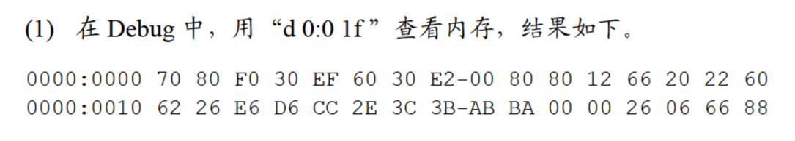

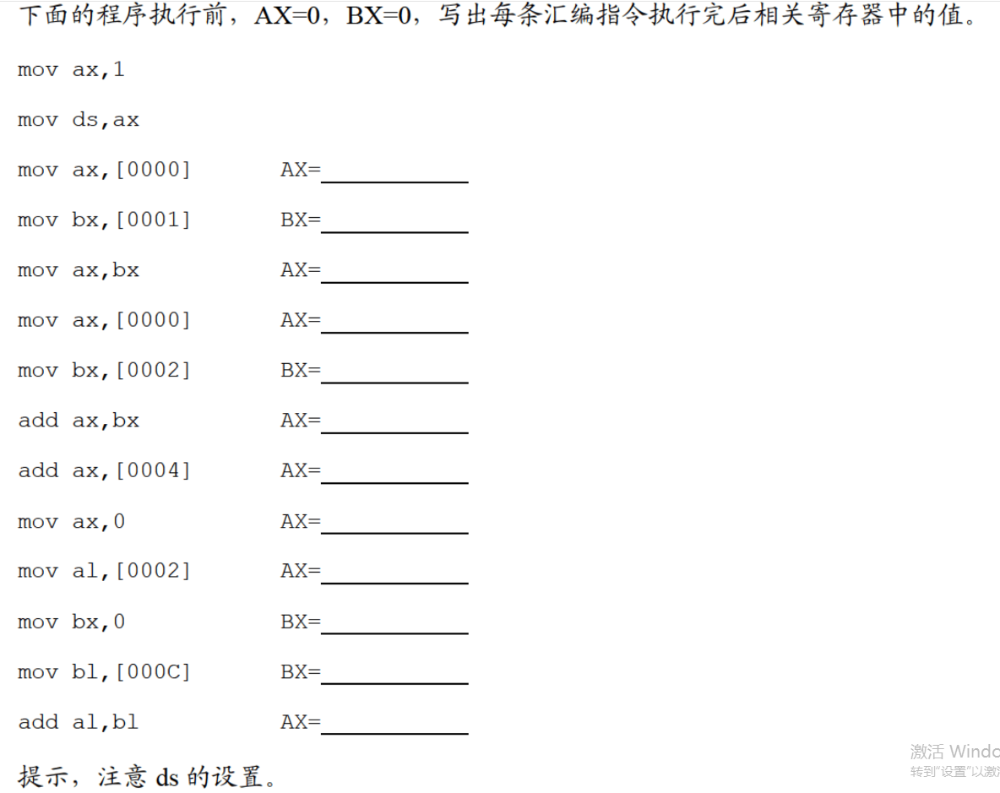

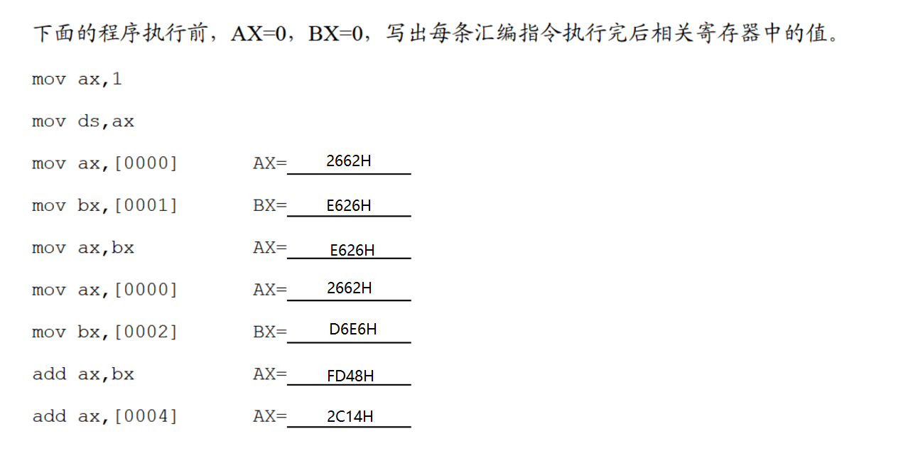

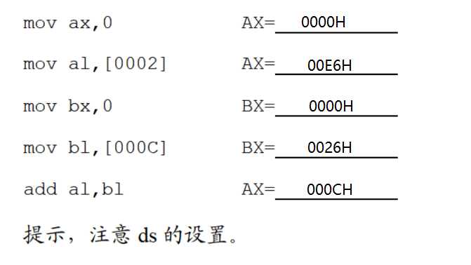

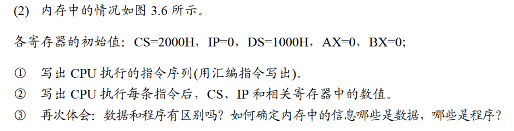

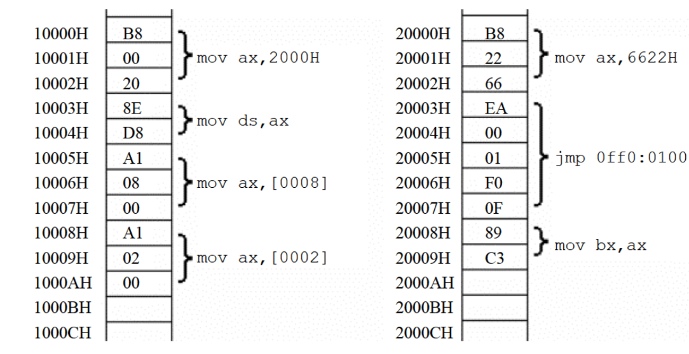

1：指令执行序列：

`movv ax,6622`

`jmp 0ff0:0100`

`mov ax,2000`

`mov dx,ax`

`mov ax,[0008]`

`mov ax,[0002]`

2：执行完每条指令后，相关寄存器的值：

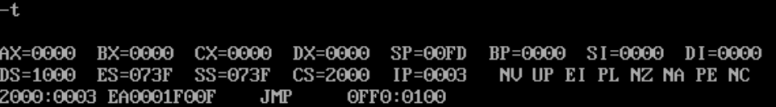

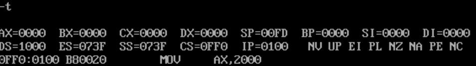

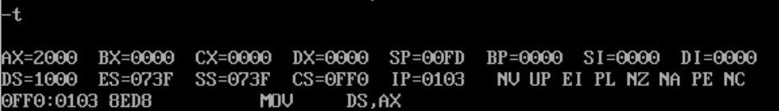

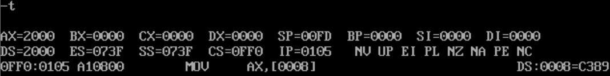

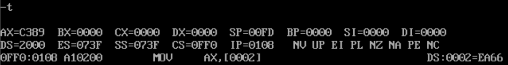

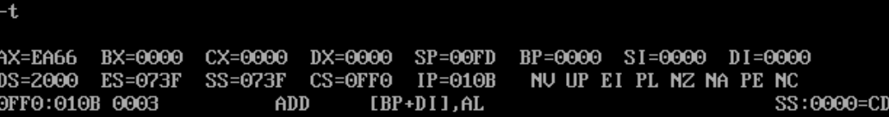

3：数据和程序没有本质区别，由CPU的访问方式决定。程序通过`CS:IP`按指令格式解析，数据通过数据段寄存器按数据格式解析。