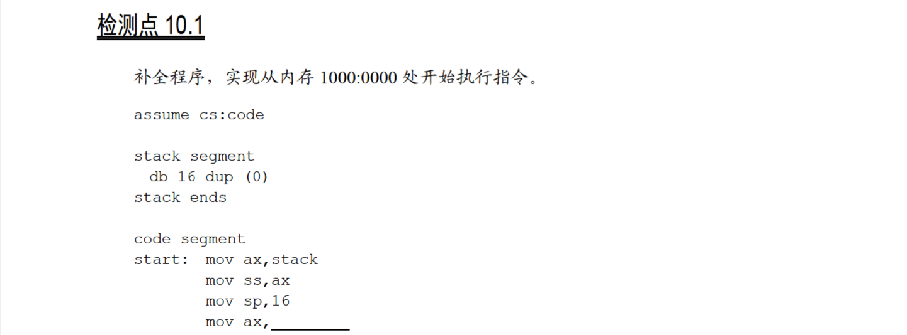
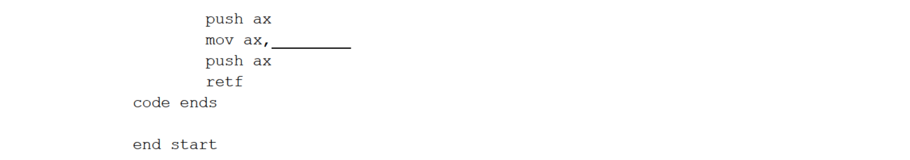
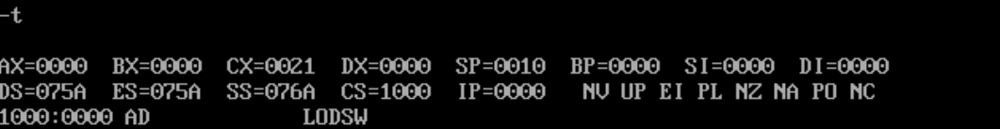

# 10.1





只要依次把`1000h`和`0000`放入栈中即可：

```
assume cs:code

stack segment
    db 16 dup (0)
stack ends

code segment
start:  mov ax,stack
        mov ss,ax
        mov sp,16
        mov ax,1000h
        push ax
        mov ax,0
        push ax
        retf
code ends

end start
```

运行结果：



确实跳到了`1000:0000`处。