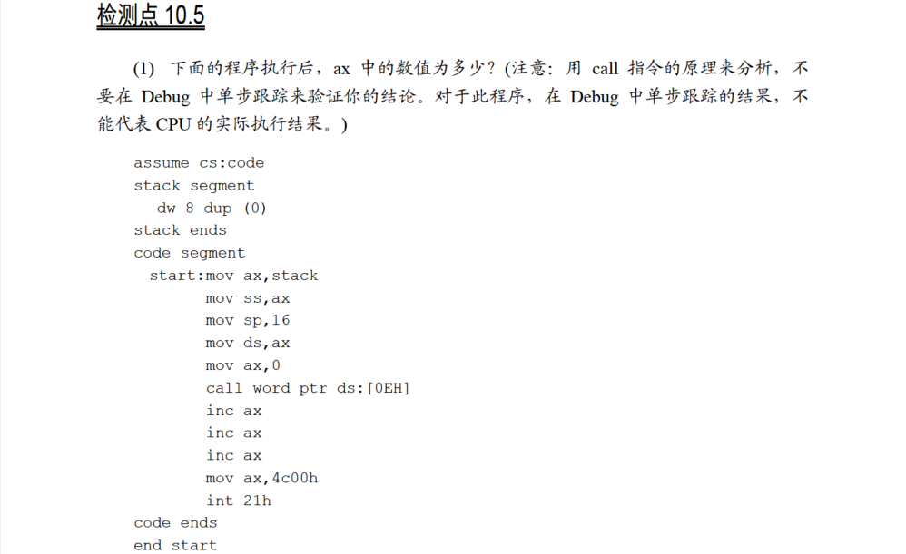
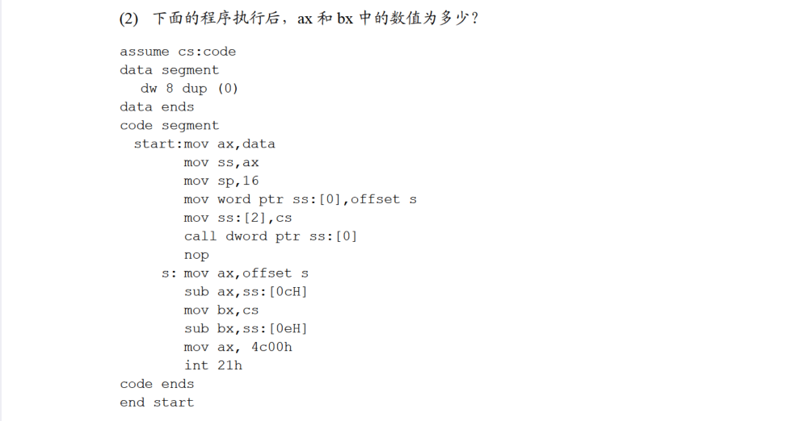

# 10.5

执行到`call word ptr ds:[0eh]`之前，程序将栈段地址和数据段地址设在了同一个位置；

执行`call word ptr ds:[0eh]`的过程类似于：

1.`push ip`，此时`ip`指向下一条指令`inc ax`的偏移地址，将`ip`入栈，栈顶元素即为`inc ax`的偏移地址，同时`ds:[0eh]`处的内容为栈顶元素；

2.`jmp word ptr ds:[0eh]`，跳转到`ds:[0eh]`中存储的偏移地址，即`inc ax`处；

接下来执行3次`inc ax`，`ax=0003h`，然后程序正常返回。

`mov word ptr ss:[0],offset s`将`ss:[0]`改为`s`的偏移地址，`mov ss:[2],cs`将`ss:[2]`改为`cs`；

接下来执行`call dword ptr ss:[0]`，过程相当于：

1.先将`call dword ptr ss:[0]`存入指令缓冲器，接着将`ip`设置为下一条指令的偏移地址，即`nop`的偏移地址；

2.`push cs`，栈顶元素为`cs`；

3.`push ip`，栈顶元素为`ip`，即`nop`的偏移地址；

然后跳转到`s`处开始执行`mov ax,offset s`，`ax`中存储的是`s`的偏移地址；

下一步将`sub ax,ss:[0ch]`将`ax`减去`ss:[0ch]`中的元素。因为之前入栈了两次，`ss:[0ch]`处存储的是`nop`的偏移地址，而`ax`中存储的是`s`的偏移地址，相减得到的结果为`nop`指令字节码的字节数，即`0001h`；

下一步将`bx`存储的值置为`cs`，`sub bx,ss:[0eh]`将`bx`中存储的值减去`ss:[0eh]`的值，`ss:[0eh]`处的值为入栈的第一个元素，即`cs`，相减得到`000h`；

至此，`ax=0001h,bx=0000h`，接下来程序正常返回。

