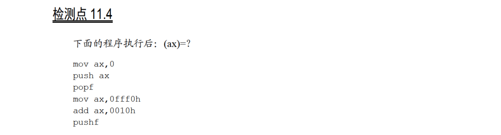

# 11.4

`popf`把标志寄存器的值设为0，然后`add ax,0010h`将`0fff0h`和`0010h`加起来，结果为0，所以`ZF=1`；产生了进位，`OF=1`；结果中0的个数是偶数，`ZF=1`；

因此标志寄存器的值为`0000100001000100`；

`pushf`和`pop ax`将`ax`设置为标志寄存器的值，`and al,11000101B`和`and ah,00001000B`执行后，`ax`的值为`0000100001000100`，即`0844h`。