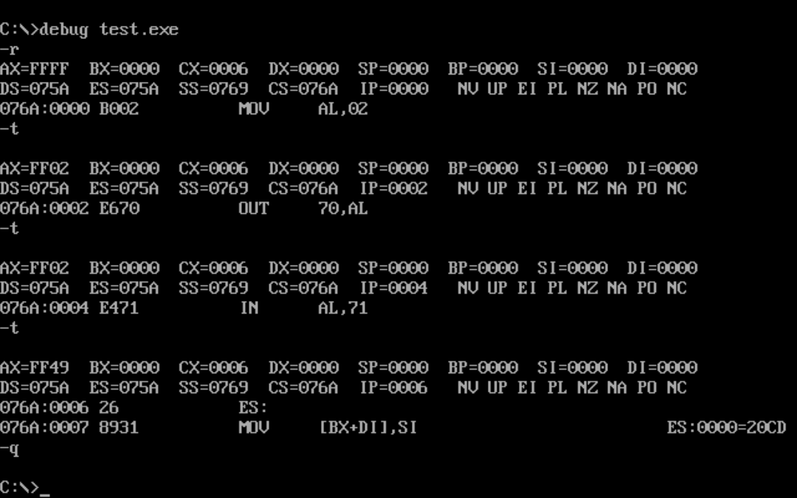
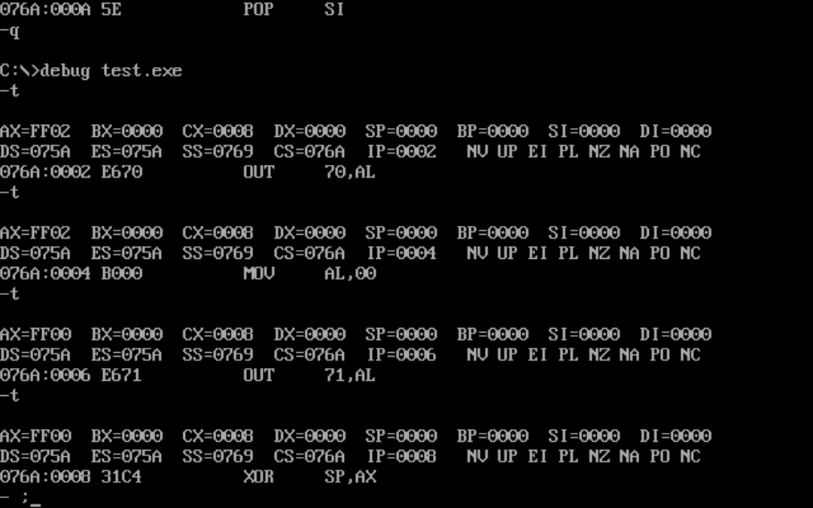

# 14.1


(1)：代码：

```
assume cs:code
code segment
start:  mov al,2
        out 70h,al
        in al,71h
code ends
end start
```

运行结果：



存储的似乎是当前时间的分钟。

(2)代码：

```
assume cs:code
code segment
start:  mov al,2
        out 70h,al
        mov al,0
        out 71h,al
code ends
end start
```

运行结果：

