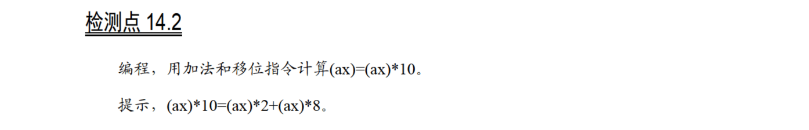
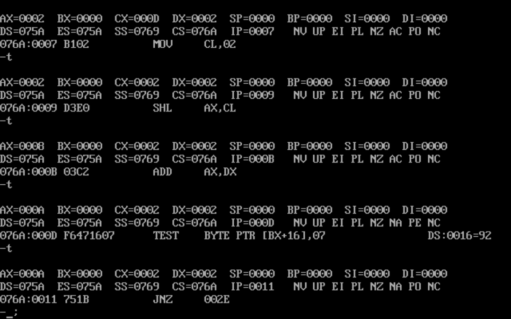

# 14.2



代码：

```
assume cs:code
code segment
start: 
        mov ax,1
        shl ax,1
        mov dx,ax
        mov cl,2
        shl ax,cl
        add ax,dx

        mov ax,4c00h
        int 21h
code ends
end start
```

运行结果：

`ax`初始时为1

