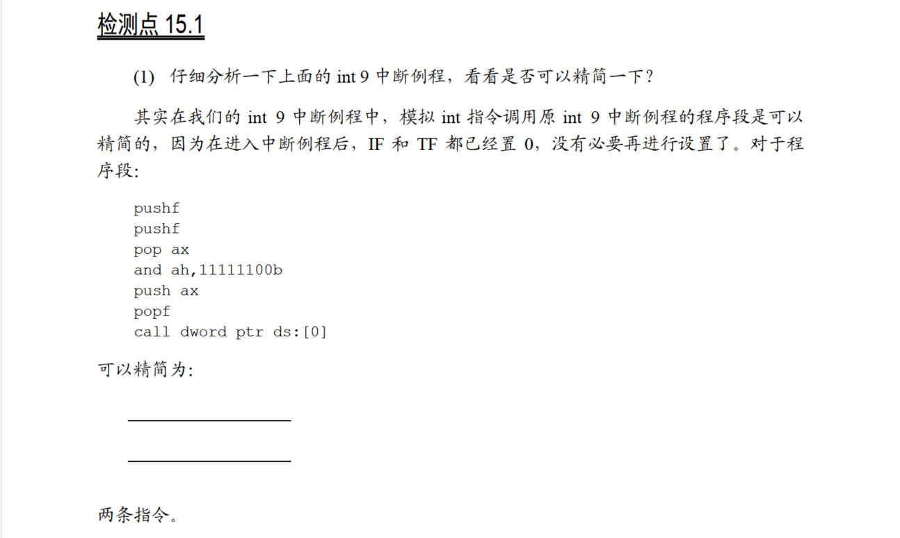
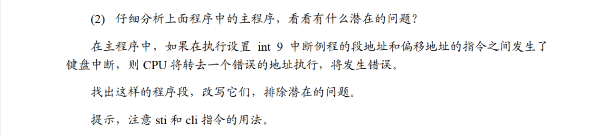

# 15.1



既然不需要设置，那就直接`pushf`就行了：

```
	pushf
	call dword ptr ds:[0]
```



在中断向量表中设置新的int 9中断例程的入口地址之前需要将`IF`设置为0：

```
	cli
	mov word ptr es:[9*4],offset int9
	mov es:[9*4+2],cs
	sti
```

在恢复中断向量表中int 9中断例程的入口之前，需要将`IF`设置为0：

```
	cli
	push ds:[0]
	pop es:[9*4]
	push ds:[2]
	pop es:[9*4+2]
	sti
```

