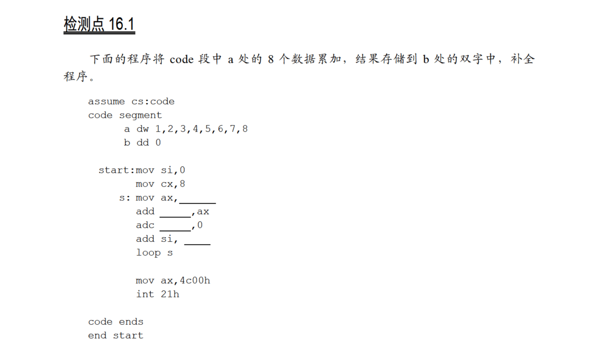
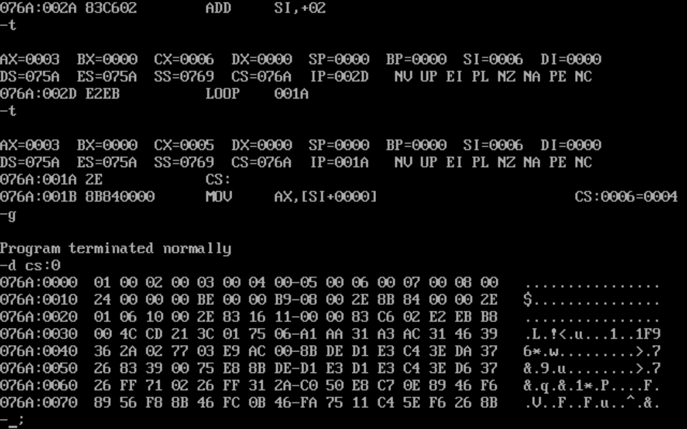

# 16.1



因为`b`处的类型是双字，所以要先将`ax`加到`b`的低位上，再将0加到`b`的高位上：

```
assume cs:code

code segment
        a dw 1,2,3,4,5,6,7,8
        b dd 0
start:  mov si,0
        mov cx,8
s:      mov ax,a[si]
        add word ptr b[0],ax
        adc word ptr b[1],0
        add si,2
        loop s

        mov ax,4c00h
        int 21h
code ends

end start
```

运行结果：

