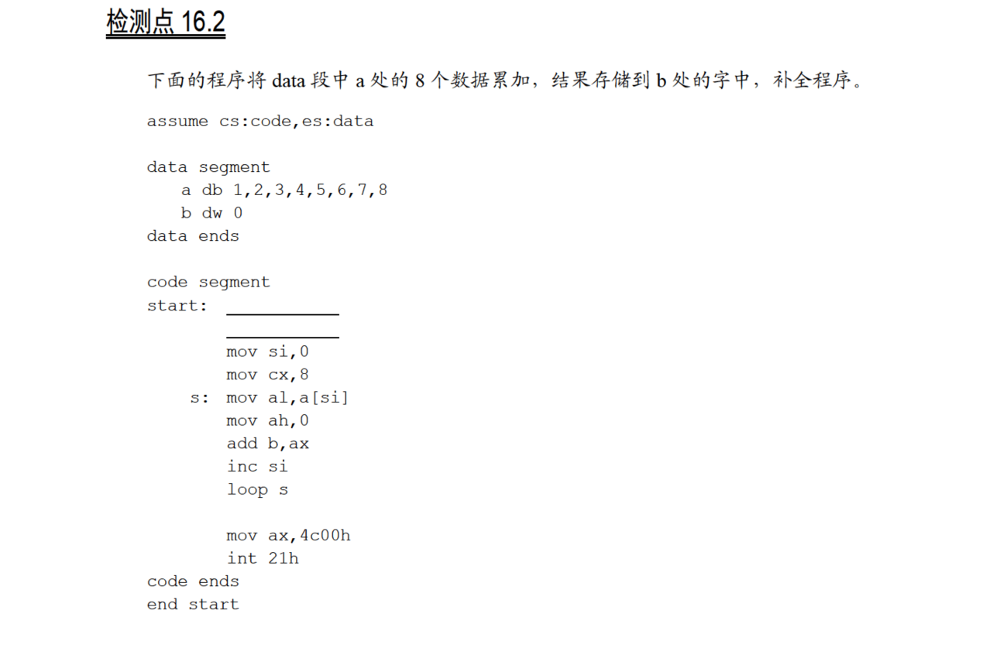
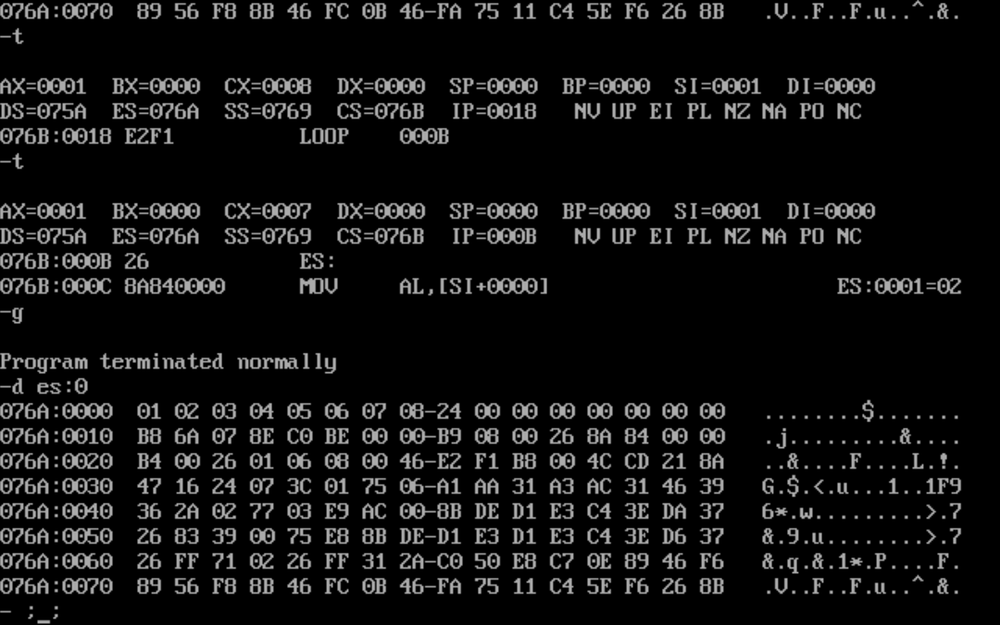

# 16.2



用`data`来设置`es`即可：

```
assume cs:code,es:data

data segment
        a db 1,2,3,4,5,6,7,8
        b dw 0
data ends

code segment

start:  mov ax,data
        mov es,ax
        mov si,0
        mov cx,8
s:      mov al,a[si]
        mov ah,0
        add b,ax
        inc si
        loop s

        mov ax,4c00h
        int 21h

code ends

end start
```

运行结果：

