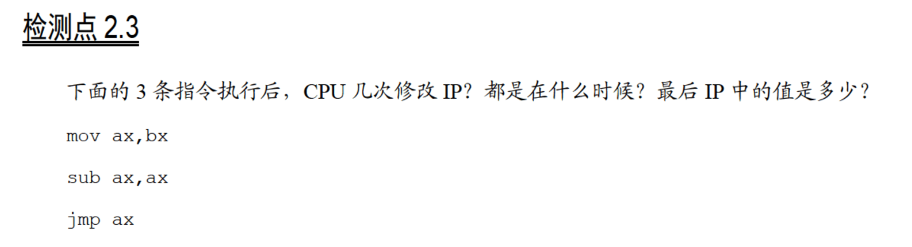

# 2.3

共修改4次。

1：将`mov ax,bx`放入指令缓冲器，同时`IP`指向`sub ax,ax`；

2：执行`mov ax,bx`，此时`ax`中存储的值为`bx`中存储的值；

3：将`sub ax,ax`放入指令缓冲器，同时`IP`指向`jmp ax`；

4：执行`sub ax,ax`，此时`ax`中存储的值为`0000H`；

5：将`jmp ax`放入指令缓冲器，同时`IP`指向下一条指令的位置；

6：执行`jmp ax`，`IP`被修改为`ax`中存储的值，即`0000H`。