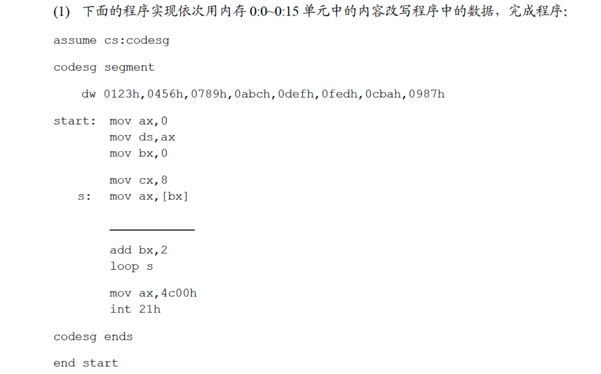
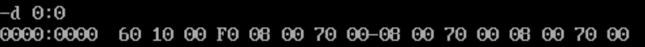
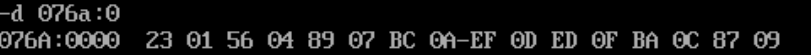
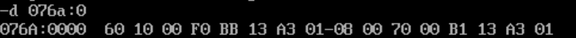
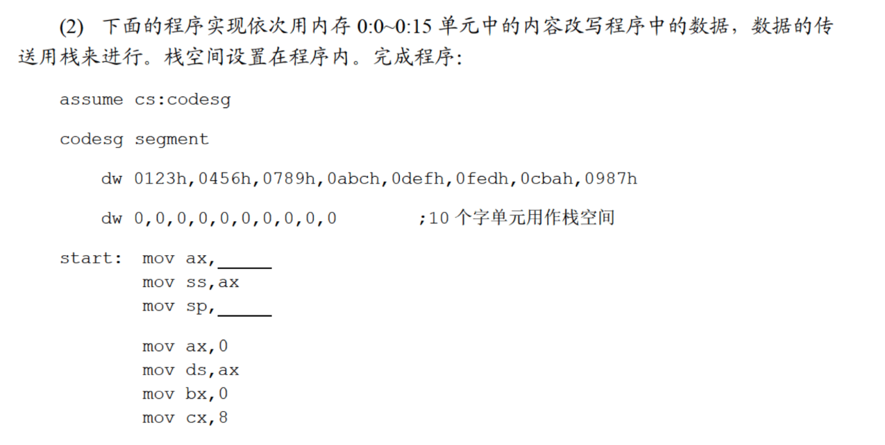
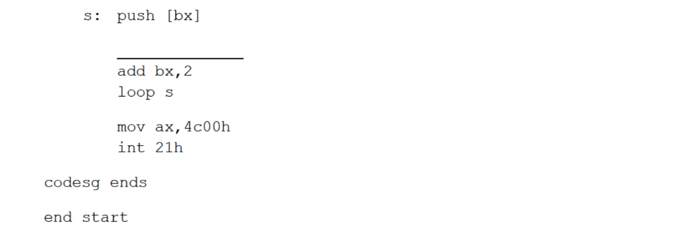
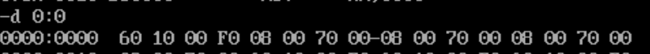
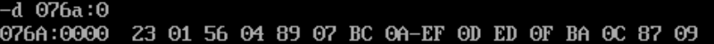
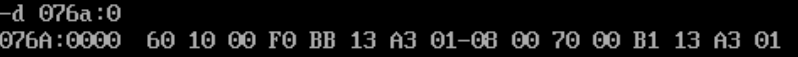

# 6.1



`ds:[bx]`指向`0:0~0:f`单元中的数据，现在要把这些数据写入程序中的数据中。程序中的数据在内存中的地址应为`cs:0~cs:f`，程序用`ax`来暂存源数据，那么下一步就应该把`ax`中暂存的数据放入`cs:[bx]`中：

```
assume cs:codesg

codesg segment

    dw 0123h,0456h,0789h,0abch,0defh,0fedh,0cbah,0987h

start:mov ax,0
    mov ds,ax
    mov bx,0

    mov cx,8
    s:mov ax,[bx]
    mov cs:[bx],ax
    add bx,2
    loop s
    mov ax,4c00h
    int 21h

codesg ends

end start
```

看一下运行结果：

初始时`0:0`中的数据：



`cs:0`中的数据：



执行后：







前两个空是设置栈段和栈顶指针。`cs:ip`指向第一条指令，而第一条指令之前的空间都是用来存储数据的，因此把`ss`设置为`cs`，把`sp`设置为`ip`即可；

最后一个空是用来将源数据转移到目标位置中的。之前已经把数据段设为`0`了，那么就应该把栈顶数据`pop`到`cs:[bx]`中：

```
assume cs:codesg

codesg segment

    dw 0123h,0456h,0789h,0abch,0defh,0fedh,0cbah,0987h

start:mov ax,0
    mov ds,ax
    mov bx,0

    mov cx,8
    s:mov ax,[bx]
    mov cs:[bx],ax
    add bx,2
    loop s
    mov ax,4c00h
    int 21h

codesg ends

end start
```

看一下结果：

初始时：





结果：

