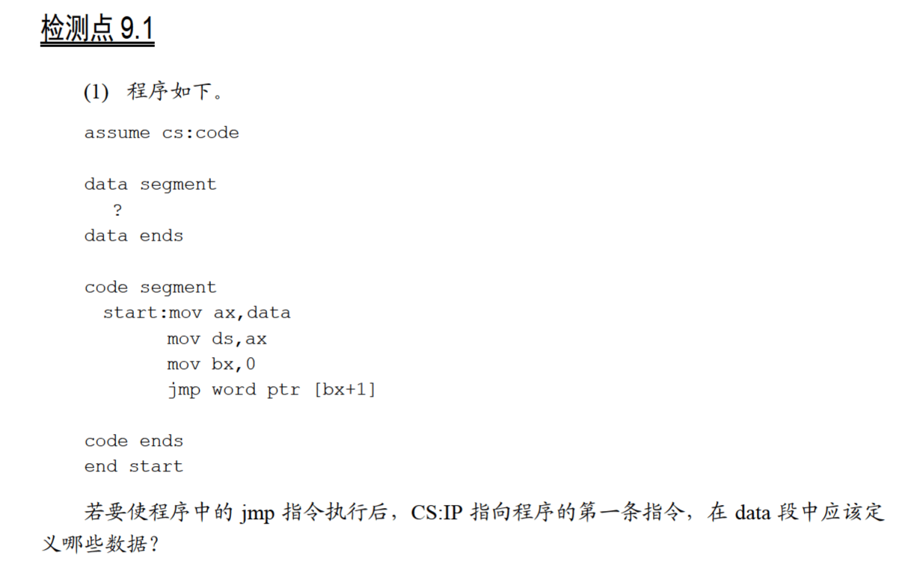
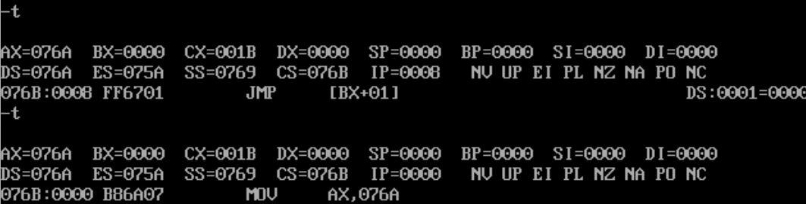
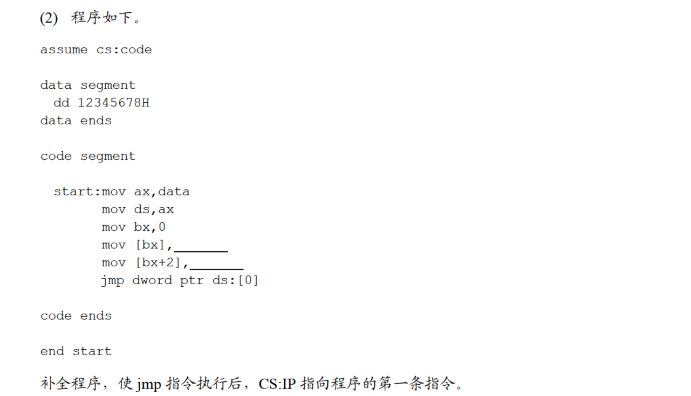
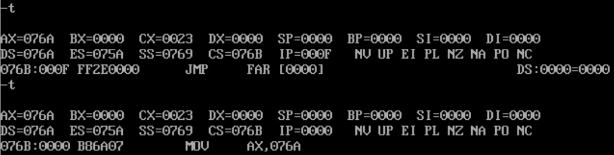
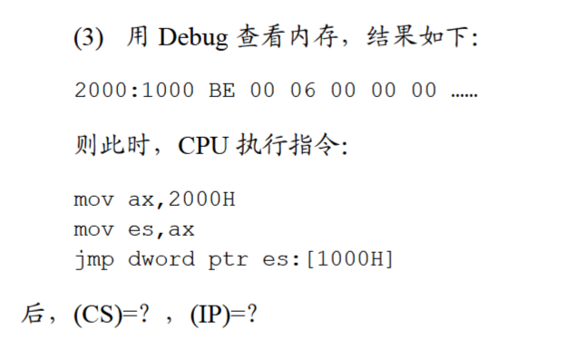

# 9.1



由`jmp word ptr [bx+1]`可知，`[bx+1]`处应该存储的是第一条指令的偏移地址，即start对应的位置：

```
assume cs:code

data segment

    db 0
    dw start

data ends

code segment

start:  mov ax,data
        mov ds,ax
        mov bx,0
        jmp word ptr [bx+1]

code ends

end start
```

运行结果：



确实回到第一条指令了。




段间转移的话，`[bx]`为偏移地址，即start；`[bx+2]`为段地址，即`cs`：

```
assume cs:code

data segment
    dd 12345678h
data ends

code segment

start:  mov ax,data
        mov ds,ax
        mov bx,0
        mov [bx],start
        mov [bx+2],cs
        jmp dword ptr ds:[0]

code ends

end start
```

运行结果：





`cs=0000,ip=00BE`。