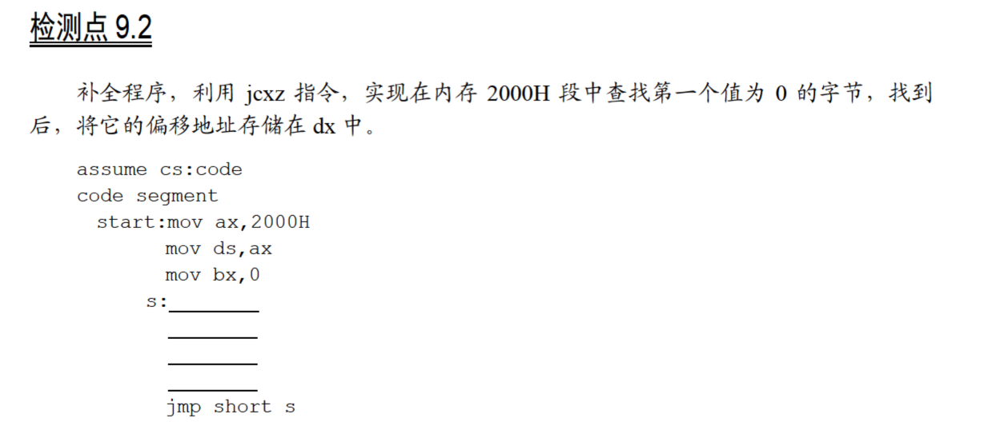
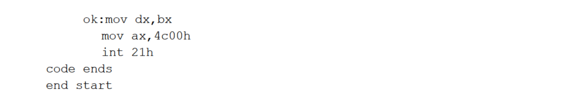

# 9.2





可以把`[bx]`处存储的字节放入`cl`中，并把`ch`置为0，然后再通过`jcxz ok`判断`cx`是否为0，如果是则跳到`ok`处，否则继续找下一位：

```
assume cs:code

code segment
    start:  mov ax,2000h
            mov ds,ax
            mov bx,0
        s:  mov cl,[bx]
            mov ch,0
            jcxz ok
            inc bx
            jmp short s
        ok: mov dx,bx
            mov ax,4c00h
            int 21h
code ends

end start
```

