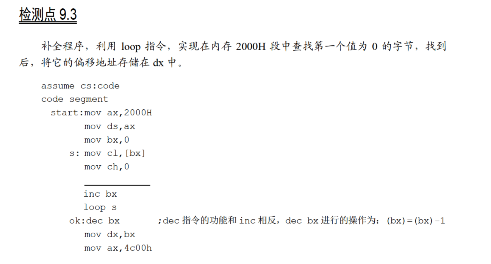
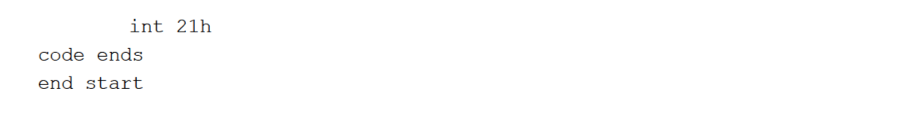

# 9.3





因为`loop`会将`cx`减1，所以如果`cx`在进入`loop`自减之前为0的话，要把`cx`先加1，这样在`loop`自减之后才能跳出循环：

```
assume cs:code

code segment
    start:  mov ax,2000h
            mov ds,ax
            mov bx,0
        s:  mov cl,[bx]
            mov ch,0
            inc cx
            inc bx
            loop s
        ok: dec bx
            mov dx,bx
            mov ax,4c00h
            int 21h
code ends

end start
```

