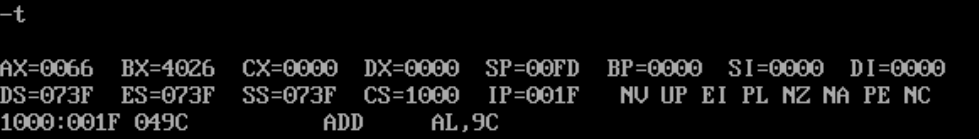

# 1

(1)使用Debug，将下面的程序段写入内存，逐条执行，观察每条指令执行后CPU中相关寄存器中内容的变化。

将指令从`1000:0000`开始，逐一输入，再将`CS:IP`设置为`1000:0000`，准备开始执行指令。

1：`mov ax,4e20`

2：`add ax,1416`

3：`mov bx,2000`

4：`add ax,bx`

5：`mov bx,ax`

6：`add ax,bx`

7：`mov ax,001a`

8：`mov bx,0026`

9：`add al,bl`

10：`add ah,bl`

11：`add bh,al`

12：`mov ah,0`

13：`add al,bl`

14：`add al,9c`

(2)将下面3条指令写入从`2000:0`开始的内存单元中，利用这3条指令计算2的8次方。

`mov ax,1`

`add ax,ax`

`jmp 2000:0003`

用-A从`2000:0000`开始输入指令，并将`CS:IP`设置为`2000:0000`，再用-T逐条执行。

(3)查看内存中的内容。

PC机主板上的ROM中写有一个生产日期，在内存`FFF00H~FFFFFH`的某几个单元中，请找到这个生产日期并试图改变它。

找了半天只找到了这个看起来像日期的玩意：

DOSbox里应该没有生产日期什么的，所以就当我找到了吧。

改一下发现改不动，因为`A000H~FFFFH`是只读的，不能修改。

(4)向内存从`B8100H`开始的单元中填写数据，如：

`-e B810:0000 01 01 02 02 03 03 04 04 `

请读者先填写不同的数据，观察产生的现象；再改变填写的地址，观察产生的现象。

改一下：

修改不了，因为`A000H~FFFFH`是只读的，不能修改。

试着在`0000:0000`改一下：

这就可以改了，因为`0~7FFFH`为主随机存储器的地址空间，可以修改。

