# 10

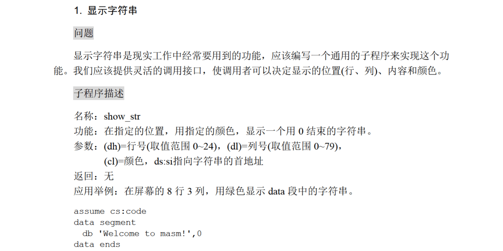

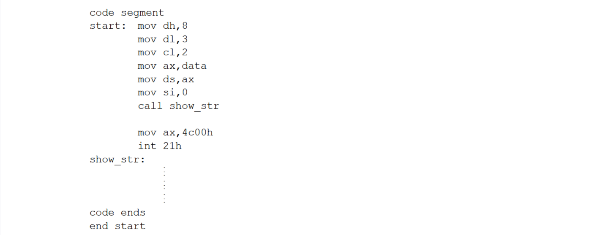

dosbox里似乎做不到将内容输出到屏幕上，只好改一下要求了，输出三次字符串：

```
assume cs:code

data segment
    message db 'Welcome to masm!$'
data ends

code segment
    start:  mov ax,data
            mov ds,ax
            mov ax,0
            mov cx,3
        s:  call show_str
            loop s
            mov ax,4c00h
            int 21h

show_str:   mov ah,09h
            lea dx,message
            int 21h
            mov ah,02h
            mov dl,13
            int 21h
            mov dl,10
            int 21h
            ret
code ends

end start
```

结果：

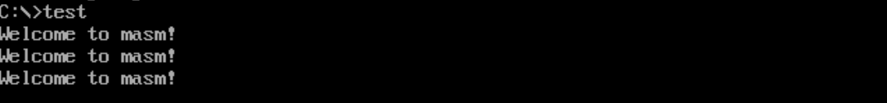

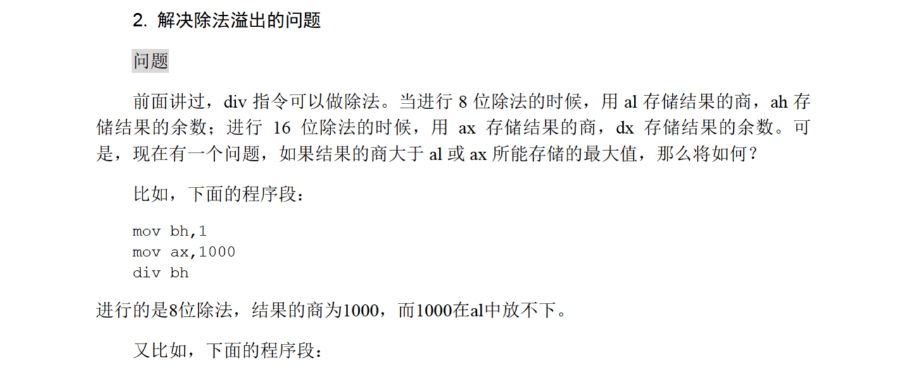

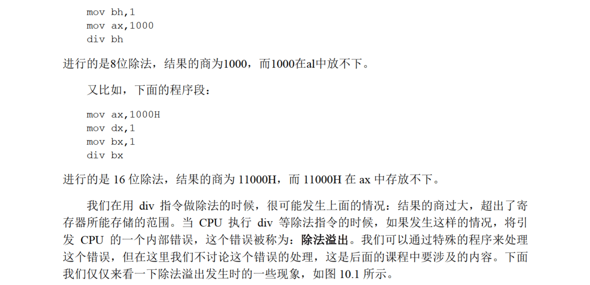

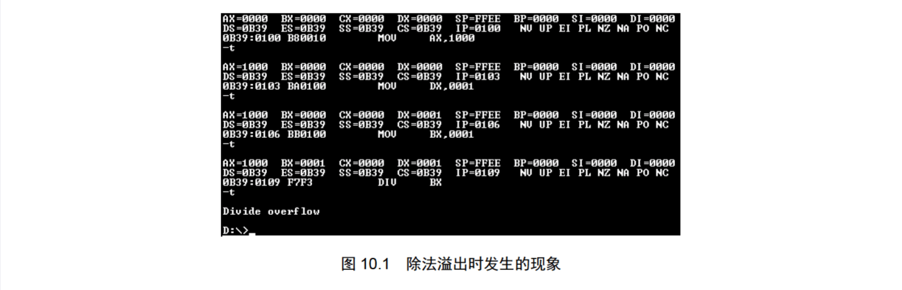

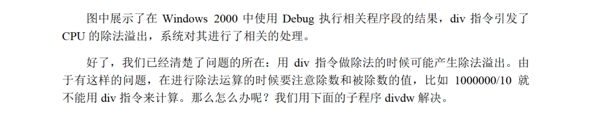

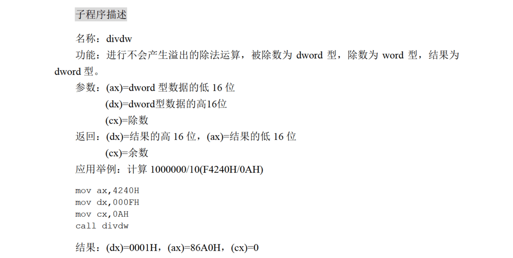

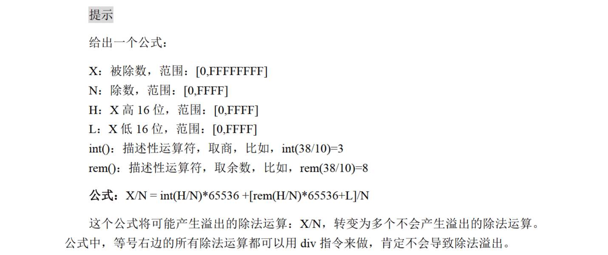

思路：先将H除以N，将int(H/N)放在`dx`中；再将rem(H/N)作为高位，L作为低位，再除以N，将得到的商放在`ax`中，再将余数放入`cx`中。

具体过程：

1：先将H除以N，将int(H/N)放在`dx`中。16位除法中，`dx`是被除数的高位，`ax`是被除数的低位；不过只将H作为被除数时，`dx`需要置零，同时要把`ax`设置为H，那么原先`ax`中存储的值需要找个地方暂存一下，代码中将L压入栈中：

```
divdw:  push ax
        mov ax,dx
        mov dx,0
        div
```

2：执行完`div`后，`dx=rem(H/N),ax=int(H/N)`，`ax`中的int(H/N)最终要作为商的高16位存储在`dx`中，但是进行下一次除法操作时`dx`还要被使用，因此先将int(H/N)暂存在`bx`中；接下来的被除数的高位是rem(H/N)，低位是L，因此把rem(H/N)送入`dx`，把栈顶的L弹入`ax`中，再执行第二次`div`：

```
		mov bx,ax
        pop ax
        div cx
```

3：执行完第二次`div`后，`dx`中存储的是最终的余数，`ax`存储的是商的低位，接下来只要调整一下各个寄存器中的值即可，把`dx`中的值送入`cx`，把`bx`中存储的商的高位存入`dx`，然后`ret`结束子程序：

```
		mov cx,dx
        mov dx,bx
        ret
```

最终代码：

```
assume cs:code,ss:stack

stack segment
    dw 0,0,0,0,0,0,0,0
stack ends

code segment
start:  mov ax,4240h
        mov dx,000fh
        mov cx,0ah
        call divdw
        mov ax,4c00h
        int 21h
divdw:  push ax
        mov ax,dx
        mov dx,0
        div cx
        mov bx,ax
        pop ax
        div cx
        mov cx,dx
        mov dx,bx
        ret
code ends

end start
```

运行结果：

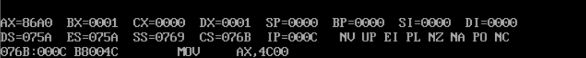


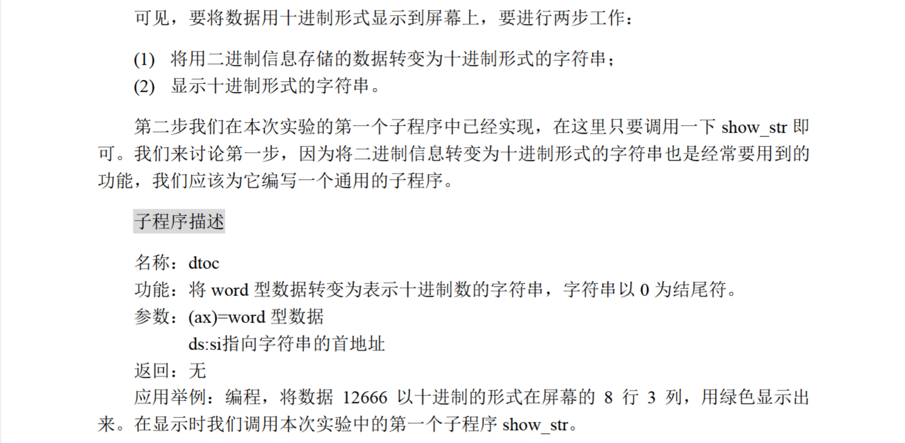


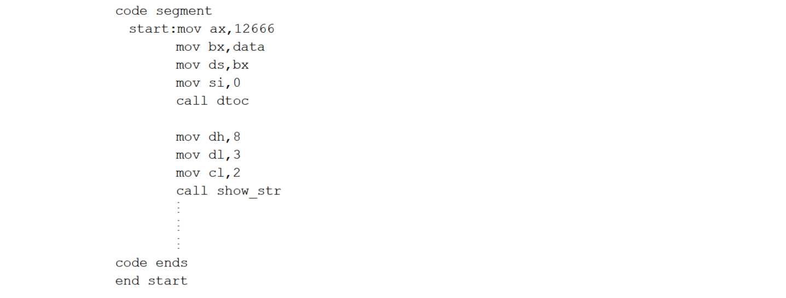

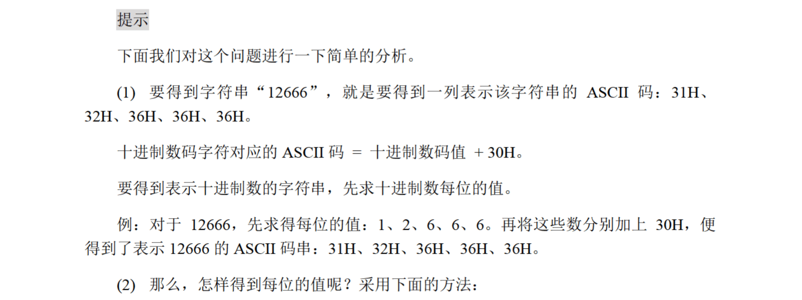

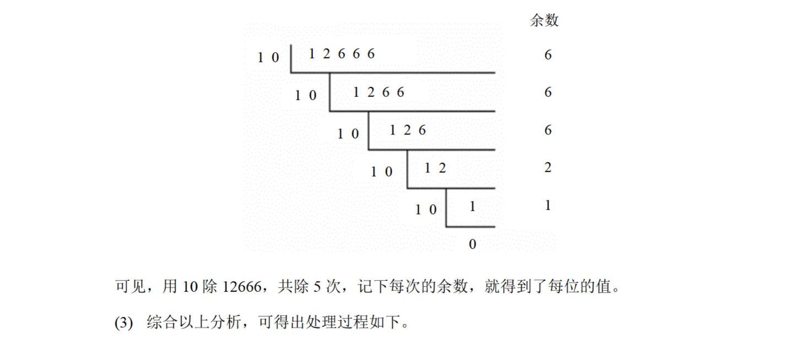

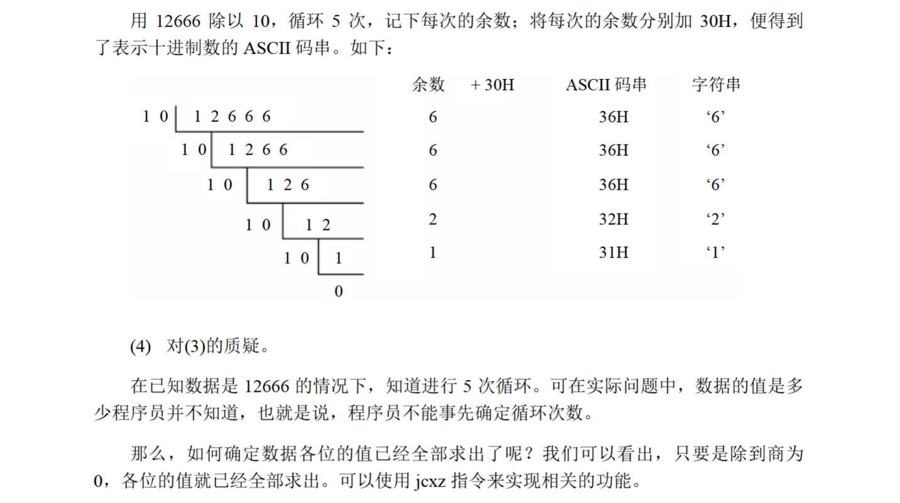

写了一个多小时终于战胜了，debug半天，主要问题还是寄存器的使用太混乱了。

思路：用`divdw`子程序将`12666`的每一位存储在栈中，然后再将栈中的每一位弹出到内存中，由于原先得到的每一位是逆序的，入栈出栈的过程中又逆序了一遍，所以最终每一位在内存中的顺序正确。

接下来一步一步走：

1：先用`divdw`子程序将`12666`的每一位存储在栈中。由于之前写的`divdw`子程序会用到`ax,bx,cx,dx`这四个寄存器，所以需要另找一个空间存储`12666`的位数，不妨存储在`ds:[2]`中；

代码中的`s0:`标记是具体取出每一位的过程的开始位置；

按照`divdw`的定义，`ax`存储低位，`dx`存储高位，`cx`存储除数，那么每一次除完之后`dx`存储商的高位，`ax`存储上的低位，`cx`存储余数；

因为`divdw`子程序会用到`ax,bx,cx,dx`这四个寄存器，所以进行下一次除法操作的时候需要把`dx`置零，`cx`置为除数，即10；

除法操作结束后，将`ds:[2]`中的位数计数器取到`bx`，再将`bx`自增，然后将`cx`中的余数加上`30h`，将其从十进制数字变成对应的字符，再将其弹入栈中；

下一步要判断`12666`是否被除尽，需要将`ax`中的商送入`cx`中，再用`jcxz`判断商是否为0，如果为0则跳到下一步，不为0继续除；

这部分代码如下：

```
dtoc:   mov dx,0
        mov cx,10
        mov bx,0
        mov ds:[2],bx
s0:     mov dx,0
        mov cx,10
        call divdw
        mov bx,ds:[2]
        inc bx
        mov ds:[2],bx
        add cx,30h
        push cx
        mov cx,ax
        jcxz ok
        jmp s0
```

2：接下来就是将栈中的每一位弹出到内存空间里了，这一部分比较简单，直接一个循环就能解决：

```
ok:     mov si,2
        mov cx,ds:[2]
        mov bx,si
s1:     pop ax
        mov ds:[bx],al
        inc bx
        loop s1
        ret
```

最终代码如下：

```
assume cs:code,ss:stack,ds:data

data segment
    dw 12666,0,0,0,0,0,0,0
data ends

stack segment
    dw 0,0,0,0,0,0,0,0
stack ends

code segment
start:  mov ax,data
        mov ds,ax
        mov ax,stack
        mov ss,ax
        mov sp,16
        mov ax,12666
        call dtoc

        mov ax,4c00h
        int 21h

divdw:  push ax
        mov ax,dx
        mov dx,0
        div cx
        mov bx,ax
        pop ax
        div cx
        mov cx,dx
        mov dx,bx
        ret

dtoc:   mov dx,0
        mov cx,10
        mov bx,0
        mov ds:[2],bx
s0:     mov dx,0
        mov cx,10
        call divdw
        mov bx,ds:[2]
        inc bx
        mov ds:[2],bx
        add cx,30h
        push cx
        mov cx,ax
        jcxz ok
        jmp s0

ok:     mov si,2
        mov cx,ds:[2]
        mov bx,si
s1:     pop ax
        mov ds:[bx],al
        inc bx
        loop s1
        ret

code ends

end start
```

运行结果：

栈中存储情况：

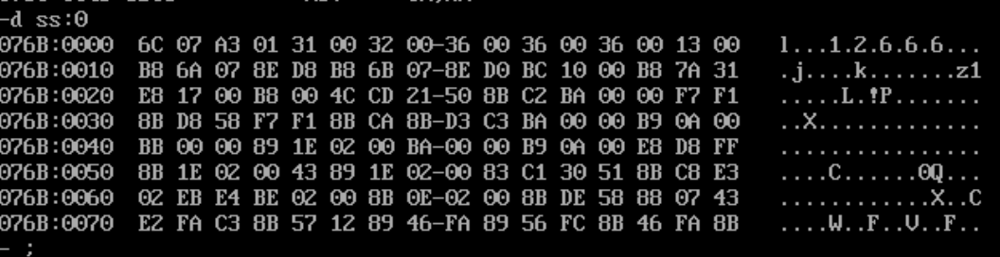

内存中存储情况：

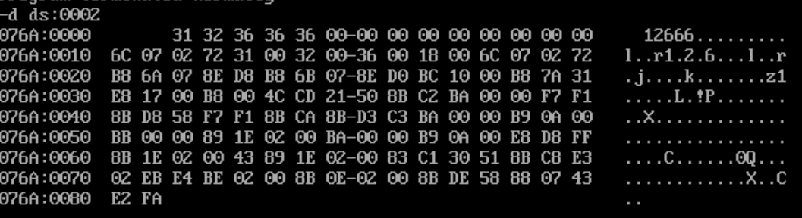