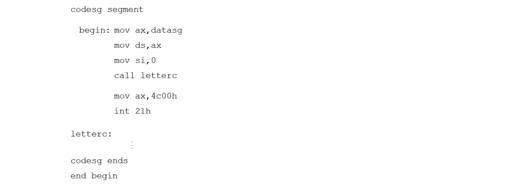
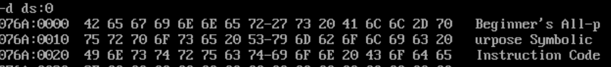
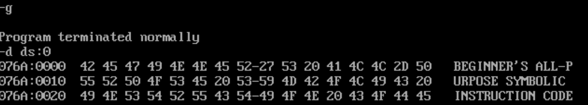

# 11




先考虑如何遍历字符串。用`lobsb`将`ds:si`处的字符存入`al`中，然后再用`cmp`将其与`0`比较，再用`jmp ok`进行跳转即可；

再考虑如何判断字符是否为小写字母。可以用`cmp al, 97`和`jb s0`来判断字符是否小于`'a'`，可以用`cmp al,122`和`ja s0`判断字符是否大于`z`。如果字符在`['a','z']`之间，那么就可以将其减去`20h`得到大写字符，再用`stosb`将其存入`es:di`。

记得把`ds`和`es`都设置为数据段的位置。

代码如下：

```
assume cs:code,ds:data

data segment
        db "Beginner's All-purpose Symbolic Instruction Code.",0
data ends

code segment
start:  mov ax,data
        mov ds,ax
        mov es,ax
        mov si,0
        mov di,0
s0:     lodsb
        cmp al,0
        je ok
        cmp al,97
        jb s1
        cmp al,122
        ja s1
        sub al,32
s1:      stosb
        jmp s0
ok:     mov ax,4c00h
        int 21h
code ends

end start
```

结果：

处理前：



处理后：

