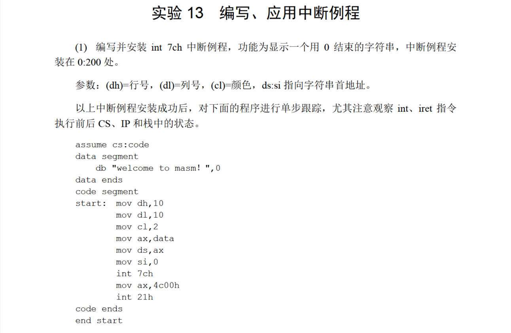
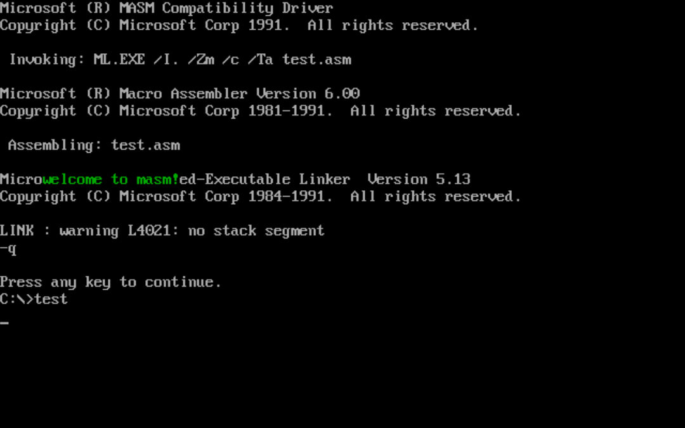
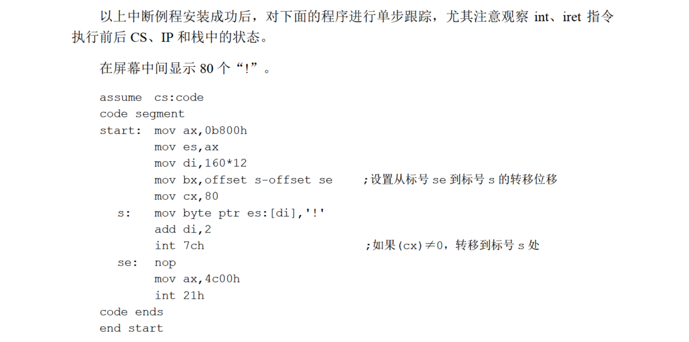
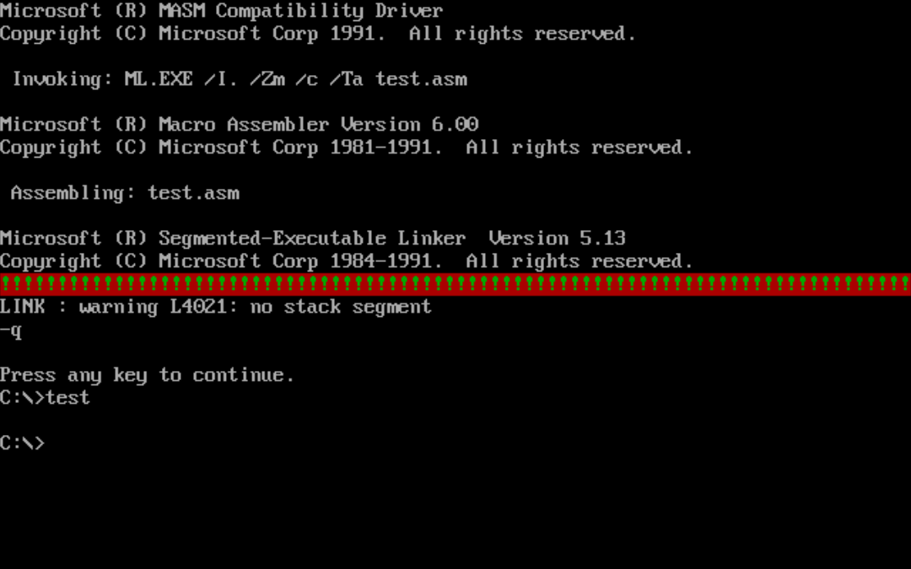
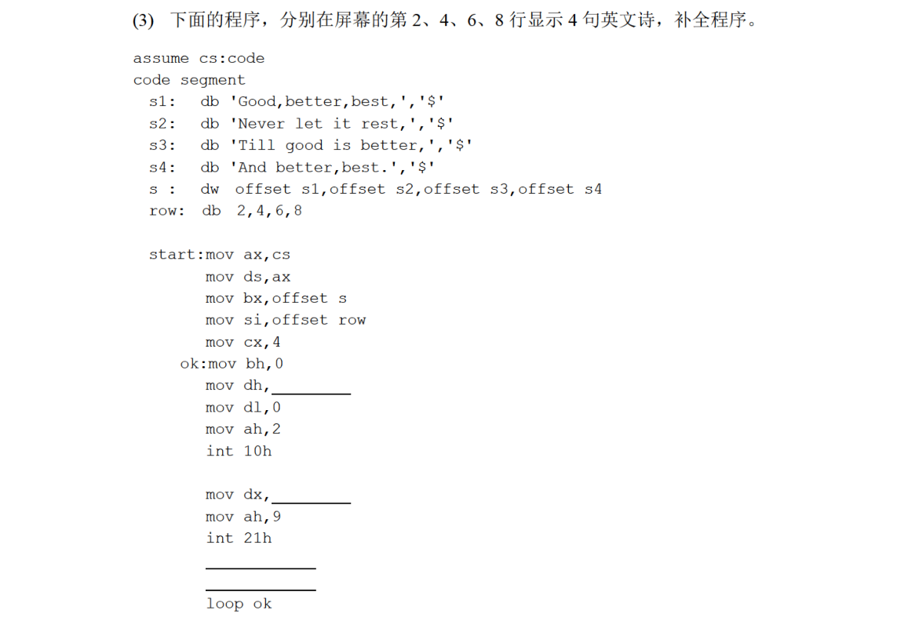
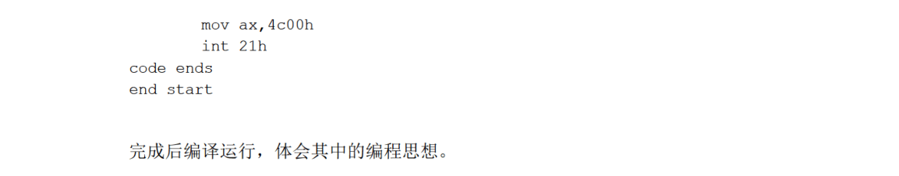
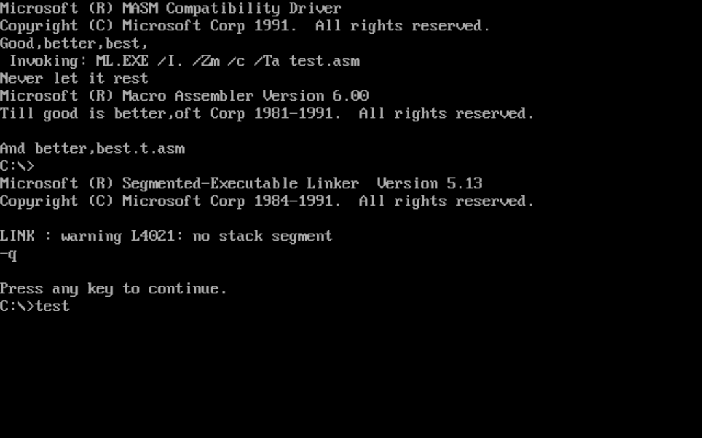

# 13



代码：

```
assume cs:code,ds:data,ss:stack

data segment
    db "welcome to masm!",0
data ends

stack segment
    dw 0,0,0,0,0,0,0,0,0,0,0,0,0,0,0,0
stack ends

code segment
start:  mov ax,stack
        mov ss,ax
        mov sp,32

        ;开始安装
        mov ax,cs
        mov ds,ax
        mov si,offset show
        mov ax,0
        mov es,ax
        mov di,200h

        mov cx,offset showend-offset show

        cld
        rep movsb
        ;安装结束
        
        ;设置中断向量表
        mov ax,0
        mov es,ax
        mov word ptr es:[7ch*4],200h
        mov word ptr es:[7ch*4+2],0
        ;设置结束
        mov dh,10
        mov dl,10
        mov cl,2
        mov ax,data
        mov ds,ax
        mov si,0
        int 7ch
        mov ax,4c00h
        int 21h
        
        ;               show
show:   push es
        mov ax,0B800h
        mov es,ax
        mov ax,0
        mov al,160
        mul dh
        mov dh,0
        add ax,dx
        mov di,ax
s:      mov al,ds:[si]
        cmp al,0
        je ok
        mov ah,cl
        stosw
        inc si
        jmp s
ok:     pop es
        iret
showend:nop
        ;               showend

code ends

end start
```

运行结果：






代码：

```
assume cs:code,ss:stack

stack segment
    dw 0,0,0,0,0,0,0,0,0,0,0,0,0,0,0,0
stack ends

code segment
start:  mov ax,stack
        mov ss,ax
        mov sp,32

        ;开始安装
        mov ax,cs
        mov ds,ax
        mov si,offset do
        mov ax,0
        mov es,ax
        mov di,200h

        mov cx,offset doend - offset do

        cld
        rep movsb
        ;安装结束
        
        ;设置中断向量表
        mov ax,0
        mov es,ax
        mov word ptr es:[7ch*4],200h
        mov word ptr es:[7ch*4+2],0
        ;设置结束
        mov ax,0b800h
        mov es,ax
        mov di,160*12
        mov bx,offset s-offset se
        mov cx,80
s:      mov al,'!'
        mov ah,11000010b
        stosw
        int 7ch
se:     nop
        mov ax,4c00h
        int 21h
       
do:     dec cx
        cmp cx,0
        je ok
        push bp
        mov bp,sp
        mov ax,ss:[bp+2]
        add ax,bx
        mov ss:[bp+2],ax
        pop bp
ok:     iret
doend: nop

code ends

end start
```

运行结果：



还能带闪烁的(





代码：

```
assume cs:code

code segment
s1:     db 'Good,better,best,','$'
s2:     db 'Never let it rest','$'
s3:     db 'Till good is better,','$'
s4:     db 'And better,best.','$'
s:      dw offset s1,offset s2,offset s3,offset s4
row:    db 2,4,6,8

start:  mov ax,cs
        mov ds,ax
        mov bx,offset s
        mov si,offset row
        mov cx,4
ok:     mov bh,0
        mov dh,[si]
        mov dl,0
        mov ah,2
        int 10h

        mov dx,[bx]
        mov ah,9
        int 21h

        add bx,2
        inc si
        loop ok

        mov ax,4c00h
        int 21h

code ends
end start

```

运行结果：



看起来有点混乱，但是它确实显示了。