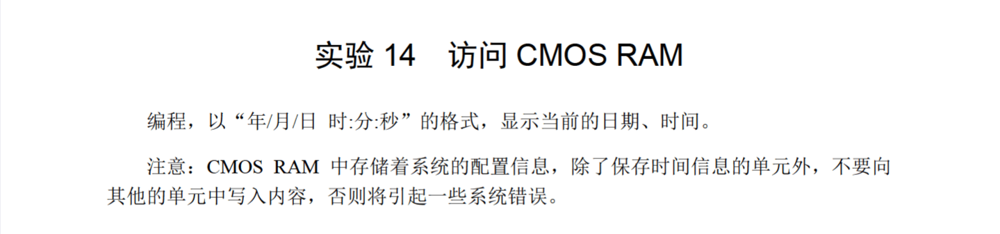
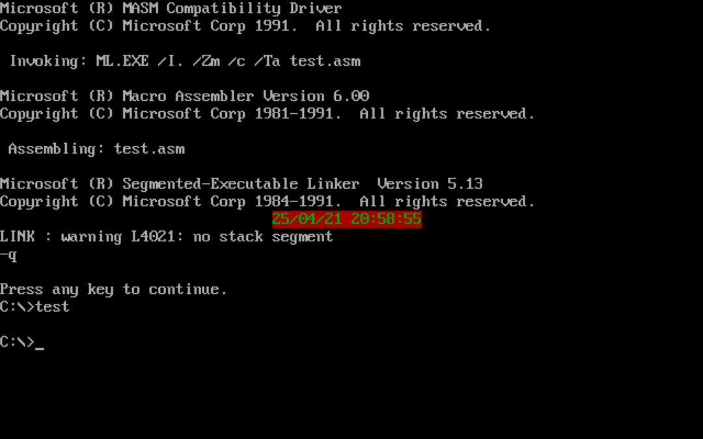

# 14



一个一个从端口读入，处理一下写到显存里就行，没有用子程序什么的写得有点长：

```
assume cs:code
code segment
start:  mov ax, 0B800h    
        mov es, ax
        mov di, 12*160+62
        
        mov al,9
        out 70h,al
        in al,71h
        mov ah,al
        and al,11110000b
        mov cx,4
        shr al,cl
        add al,30h
        stosb              
        mov al, 11000010b     
        stosb     
        mov al,ah
        and al,00001111b
        add al,30h
        stosb              
        mov al, 11000010b     
        stosb    

        mov al,'/'
        stosb              
        mov al, 11000010b     
        stosb    

        mov al,8
        out 70h,al
        in al,71h
         mov ah,al
        and al,11110000b
        mov cx,4
        shr al,cl
        add al,30h
        stosb              
        mov al, 11000010b     
        stosb     
        mov al,ah
        and al,00001111b
        add al,30h
        stosb              
        mov al, 11000010b     
        stosb    

        mov al,'/'
        stosb              
        mov al, 11000010b     
        stosb    

        mov al,7
        out 70h,al
        in al,71h
        mov ah,al
        and al,11110000b
        mov cx,4
        shr al,cl
        add al,30h
        stosb              
        mov al, 11000010b     
        stosb     
        mov al,ah
        and al,00001111b
        add al,30h
        stosb              
        mov al, 11000010b     
        stosb    

        mov al,' '
        stosb              
        mov al, 11000010b     
        stosb    

        mov al,4
        out 70h,al
        in al,71h
        mov ah,al
        and al,11110000b
        mov cx,4
        shr al,cl
        add al,30h
        stosb              
        mov al, 11000010b     
        stosb     
        mov al,ah
        and al,00001111b
        add al,30h
        stosb              
        mov al, 11000010b     
        stosb    

        mov al,':'
        stosb              
        mov al, 11000010b     
        stosb   

        mov al,2
        out 70h,al
        in al,71h
        mov ah,al
        and al,11110000b
        mov cx,4
        shr al,cl
        add al,30h
        stosb              
        mov al, 11000010b     
        stosb     
        mov al,ah
        and al,00001111b
        add al,30h
        stosb              
        mov al, 11000010b     
        stosb    

        mov al,':'
        stosb              
        mov al, 11000010b     
        stosb   

        mov al,0
        out 70h,al
        in al,71h
        mov ah,al
        and al,11110000b
        mov cx,4
        shr al,cl
        add al,30h
        stosb              
        mov al, 11000010b     
        stosb     
        mov al,ah
        and al,00001111b
        add al,30h
        stosb              
        mov al, 11000010b     
        stosb    

        mov ax,4c00h
        int 21h
code ends

end start
```

运行结果：

