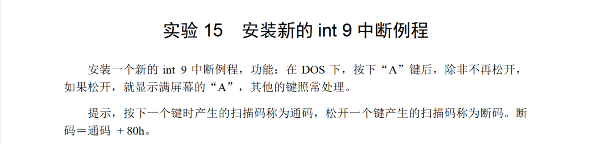
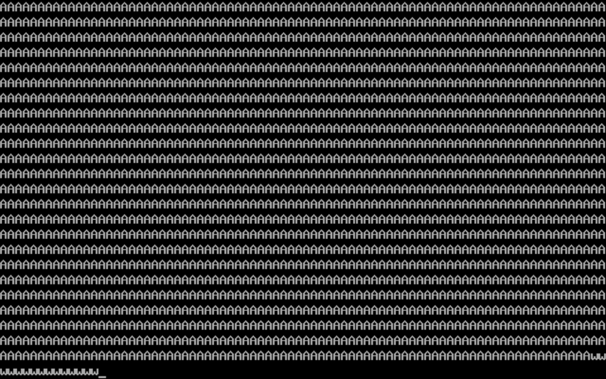

# 15



大体部分跟15.5的代码差不多，关键点是判断是否按下过'A'和是否松开'A'，用`ds:[0]`当作一个标志，表示'A'是否被按下过即可：

```
        cmp al,1eh
        jne check
        mov ax,1
        mov ds:[0],ax
        jmp int9ret

check:  cmp al,9eh
        jne int9ret
        mov ax,ds:[0]
        cmp ax,1
        jne int9ret
        mov ax,0
        mov ds:[0],ax
```

代码：

```
assume cs:code,ss:stack,ds:data

stack segment
        db 128 dup (0)
stack ends

data segment
        dw 0,0,0,0,0,0,0,0,0,0
data ends

code segment
start:  mov ax,stack
        mov ss,ax
        mov sp,128
        mov ax,data
        mov ds,ax

        push cs
        pop ds

        mov ax,0
        mov es,ax

        mov si,offset int9
        mov di,204h
        mov cx,offset int9end - offset int9
        cld

        rep movsb
        
        push es:[9*4]
        pop es:[200h]
        push es:[9*4+2]
        pop es:[202h]

        cli
        mov word ptr es:[9*4],204h
        mov word ptr es:[9*4+2],0
        sti

        mov ax,4c00h
        int 21h

int9:   push ax
        push bx
        push cx
        push es

        in al,60h

        pushf
        call dword ptr cs:[200h]

        cmp al,1eh
        jne check
        mov ax,1
        mov ds:[0],ax
        jmp int9ret

check:  cmp al,9eh
        jne int9ret
        mov ax,ds:[0]
        cmp ax,1
        jne int9ret
        mov ax,0
        mov ds:[0],ax

        mov ax,0b800h
        mov es,ax
        mov di,0
        mov cx,2000
        mov al,'A'
s:      stosb
        inc di
        loop s

int9ret:pop es
        pop cx
        pop bx
        pop ax
        iret

int9end:nop

code ends
end start
```

运行结果：

