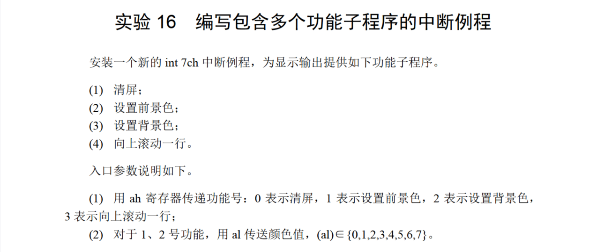
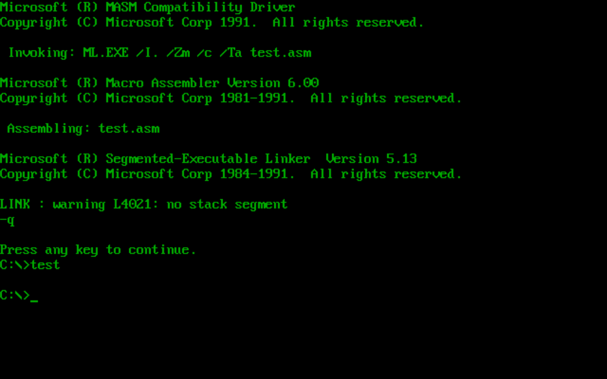
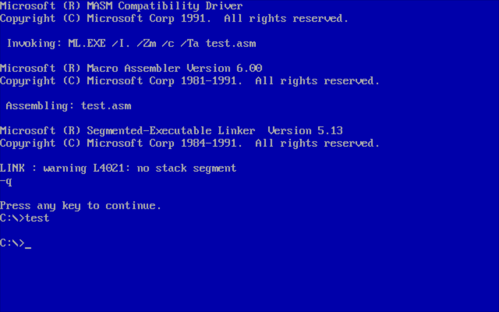
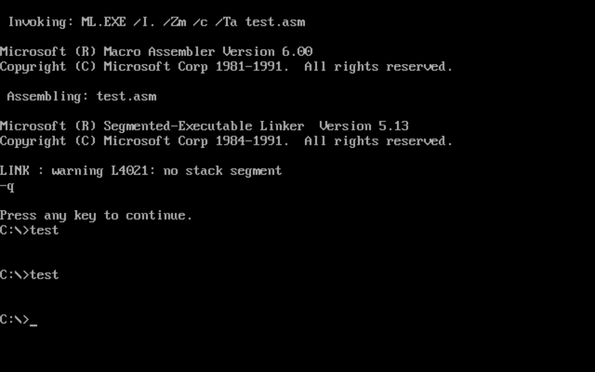

# 16



中断程序主体部分跟16.4的代码差不多，把它安装到`0:200`再设置一下`7ch`的入口地址即可：

```
assume cs:code,ds:data,ss:stack

data segment
        dw 0,0,0,0,0,0,0,0
data ends

stack segment
        db 128 dup(0)
stack ends

code segment
start:  mov ax,data
        mov ds,ax
        mov ax,stack
        mov ss,ax
        mov sp,128
        
        mov ax,cs
        mov ds,ax
        mov si,offset setscreen 
        mov ax,0
        mov es,ax
        mov di,200
        mov cx,offset setscreenend-offset setscreen
        cld
        rep movsb

        mov ax,0
        mov es,ax
        mov ax,200
        mov es:[7ch*4],ax
        mov ax,0
        mov es:[7ch*4+2],ax

        mov ah,1
        mov al,6
        int 7ch
        mov ah,2
        mov al,1
        int 7ch
        mov ax,4c00h
        int 21h

setscreen:      jmp short set

        table   dw sub1,sub2,sub3,sub4

set:            push bx

                cmp ah,0
                jne nxt1
                call sub1
nxt1:           cmp ah,1
                jne nxt2
                call sub2
nxt2:           cmp ah,2
                jne nxt3
                call sub3
nxt3:           cmp ah,3
                jne sret
                call sub4
sret:           pop bx
                iret

sub1:   push bx
        push cx
        push es
        push ax
        mov bx,0b800h
        mov es,bx
        mov bx,0
        mov cx,2000
sub1s:  mov byte ptr es:[bx],' '
        add bx,2
        loop sub1s
        pop ax
        pop es
        pop cx
        pop bx
        ret

sub2:   push bx
        push cx
        push es

        mov bx,0b800h
        mov es,bx
        mov bx,1
        mov cx,2000
sub2s:  and byte ptr es:[bx],11111000b
        or es:[bx],al
        add bx,2
        loop sub2s

        pop es
        pop cx
        pop bx 
        ret

sub3:   push bx
        push cx
        push es
        mov cl,4
        shl al,cl
        mov bx,0b800h
        mov es,bx
        mov bx,1
        mov cx,2000
sub3s:  and byte ptr es:[bx],10001111b
        or es:[bx],al
        add bx,2
        loop sub3s
        pop es
        pop cx
        pop bx
        ret

sub4:   push cx
        push si
        push di
        push es
        push ds

        mov si,0b800h
        mov es,si
        mov ds,si
        mov si,160
        mov di,0
        cld
        mov cx,24

sub4s:  push cx
        mov cx,160
        rep movsb
        pop cx
        loop sub4s

        mov cx,80
        mov si,0
sub4s1: mov byte ptr [160*24+si],' '
        add si,2
        loop sub4s1

        pop ds
        pop es
        pop di
        pop si
        pop cx
        ret
setscreenend:   nop
code ends

end start
```

运行结果：

清屏：


设置前景色：



设置背景色： 



向上滚动一行：



看上去不明显，但是确实滚动了(