# 2

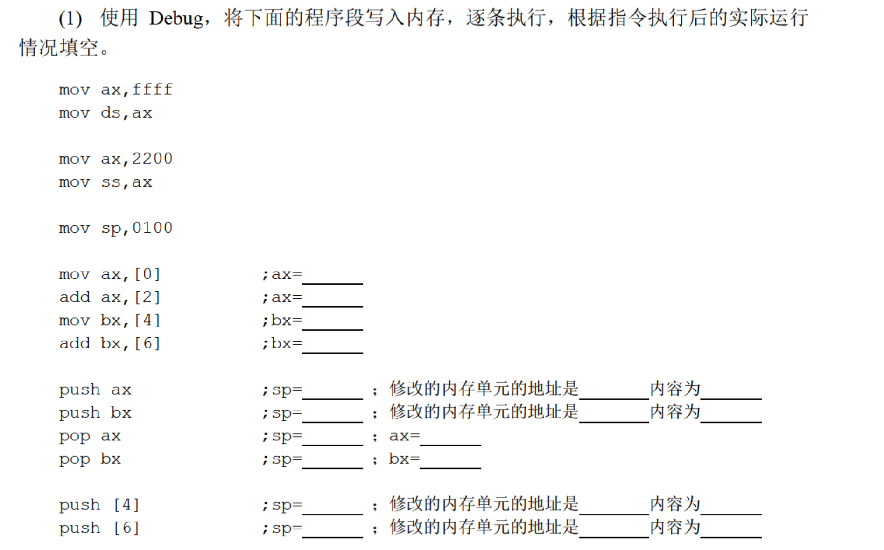

分析：

`mov ax,ffff`

`mov ds,ax`

将`ffff0`作为数据段的起始地址，段中的内容如下：

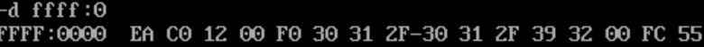

`mov ax,2200`

`mov ss,ax`

`mov sp,0100`

初始时栈顶指向`2200:0100`；

`mov ax,[0]`：将`ffff:0000`中的字存入`ax`，此时`ax=C0EA`：

`add ax,[2]`：`ax=ax+0012`，此时`ax=C0FC`：

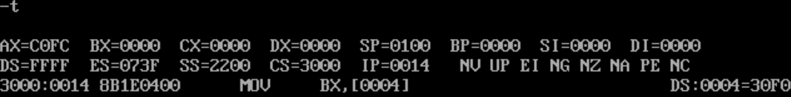

`mov bx,[4]`：将`ffff:0004`中的字存入`bx`，此时`bx=30F0`：

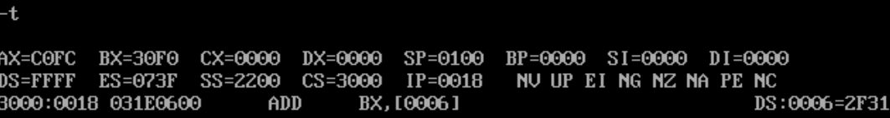

`add bx,[6]`：`bx=bx+2F31`，此时`bx=6021`：

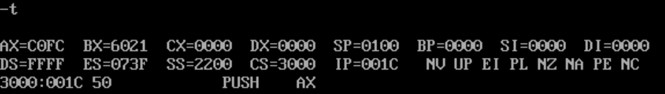

`push ax`

`push bx`

将`ax,bx`中的字压入栈，栈中的内容为：

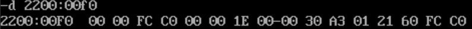

`pop ax`

`pop bx`

相当于交换`ax,bx`中的内容：

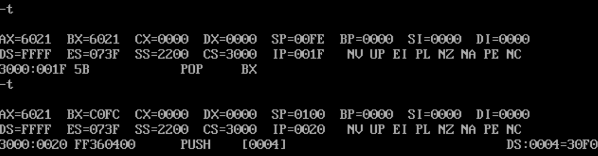

看了一眼栈中的内容：

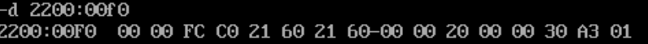

发现之前的`C0FC`和`6021`被覆盖了，而且栈中其它空间中的内容也不同；

`push [4]`：将栈顶的内容(`01A3`)存入`ffff:0004`：

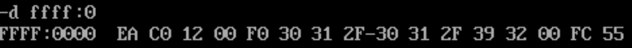

如果执行成功，那么数据段的内容应该为`EA C0 12 00 A3 01 ......`，但是数据段中的内容并没有改变。由本书1.15中的内容得知，`C0000~FFFFF`为ROM地址空间，不可被修改；

`push [6]`：将栈顶内容存入`ffff:0006`，先看一下栈中内容：

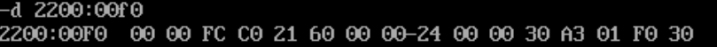

发现栈中内容又变化了，此时栈顶内容又为`01A3`，执行指令：

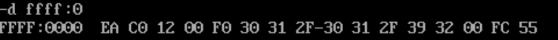

数据段中内容没有变化。

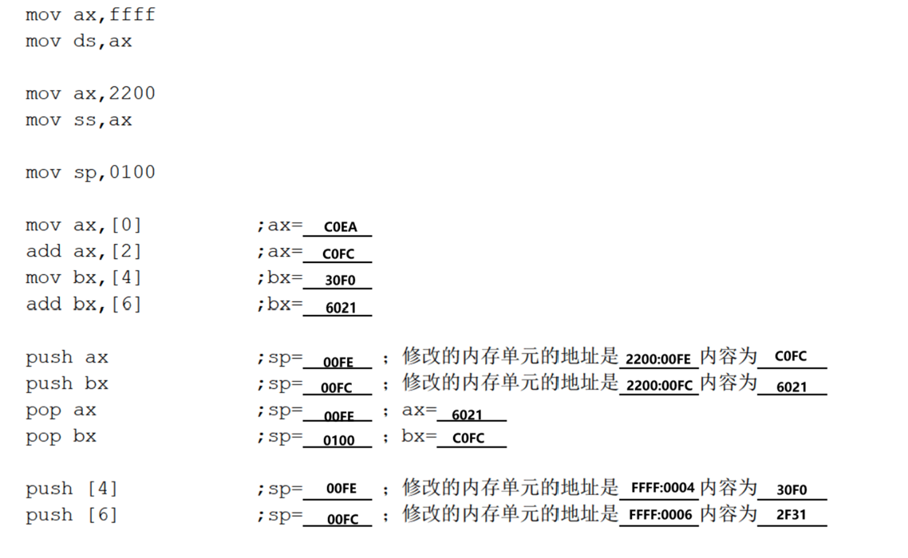