# 3

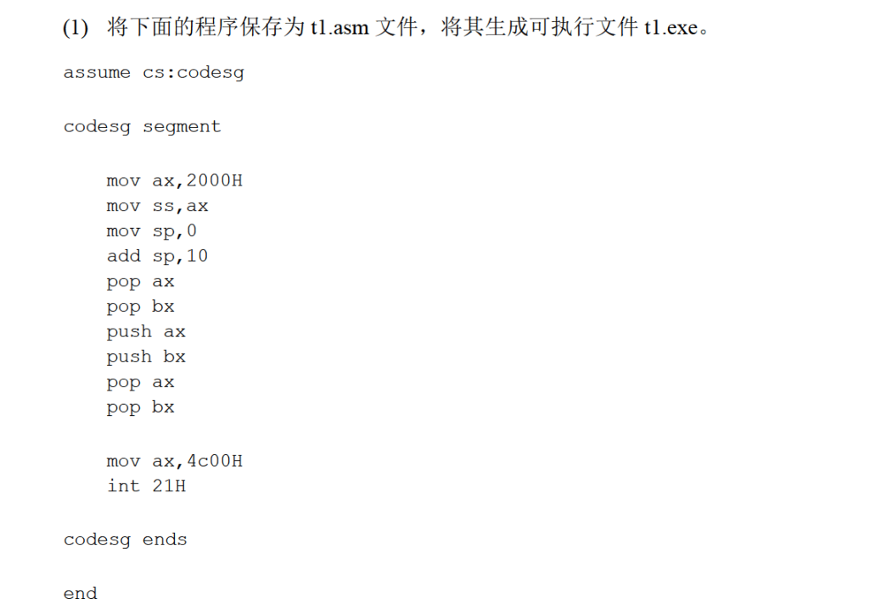

程序如下：

```
assume cs:codesg

codesg segment

        mov ax,2000
        mov ss,ax
        mov sp,0
        add sp,10
        pop ax
        pop bx
        push ax
        push bx
        pop ax
        pop bx

        mov ax,4c00h
        int 21h

codesg ends

end
```

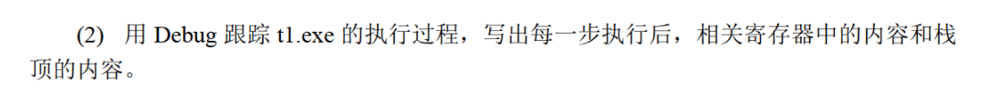

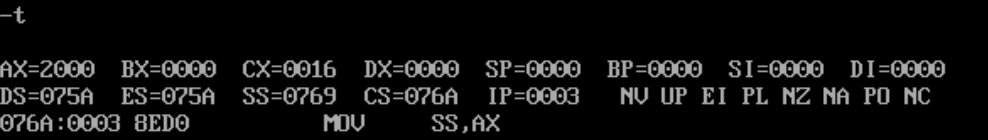

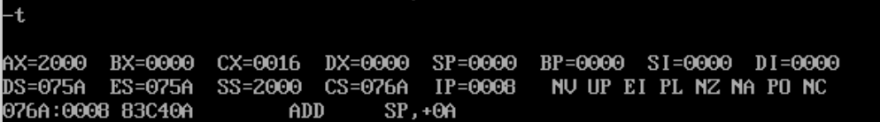

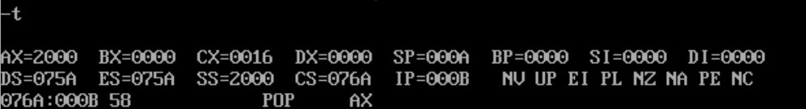

这时去看一眼栈顶内容：

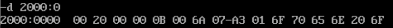

`2000:000A`指向的字是`706A`；

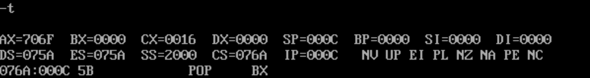

那么接下来`bx`就应该是`6E65`；

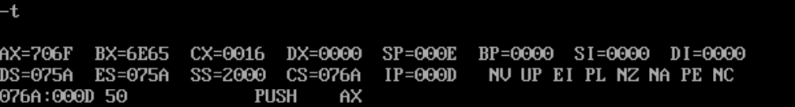

接下来的4条指令利用栈来交换`ax,bx`中的内容：

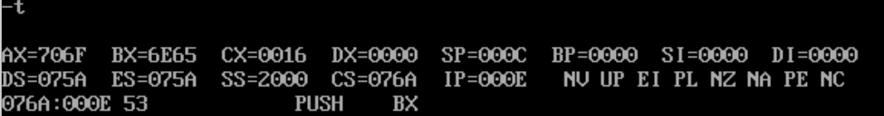

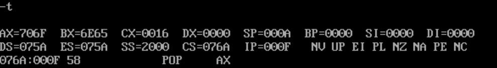

此时栈中内容为：

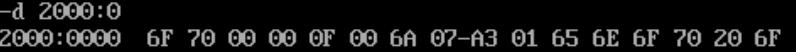

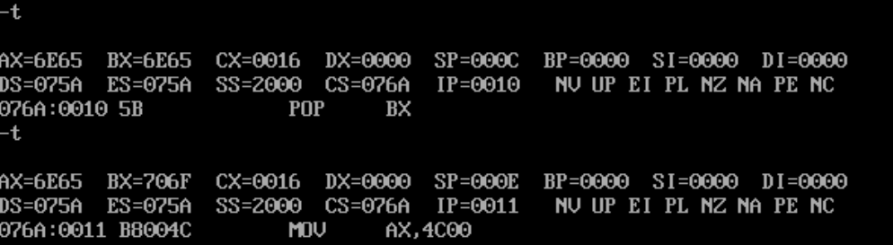

确实交换了(

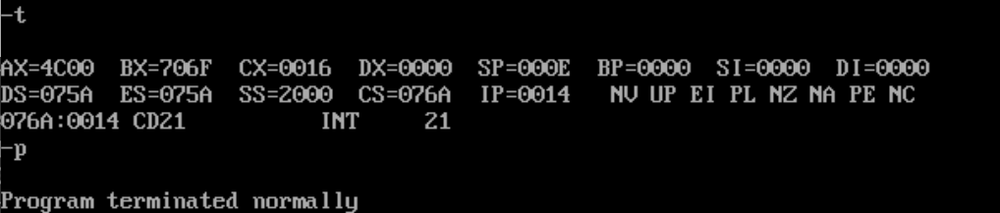

然后就结束了。

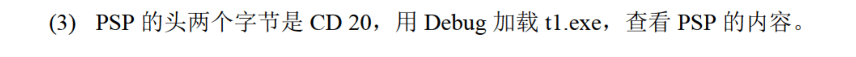

从`ds:0000`开始的256字节为PSP，看一下内容：

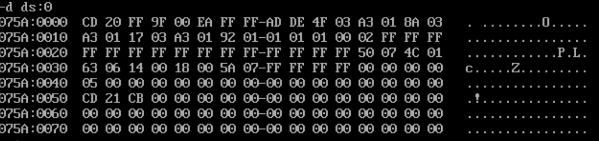

确实是`CD 20`开头的。