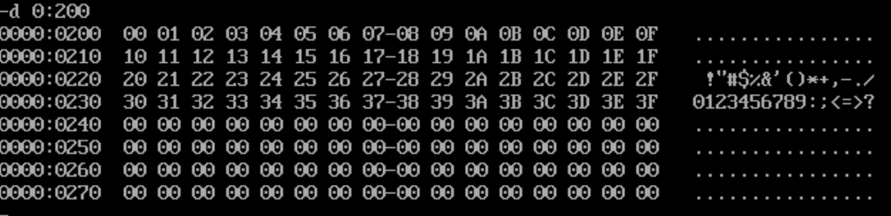
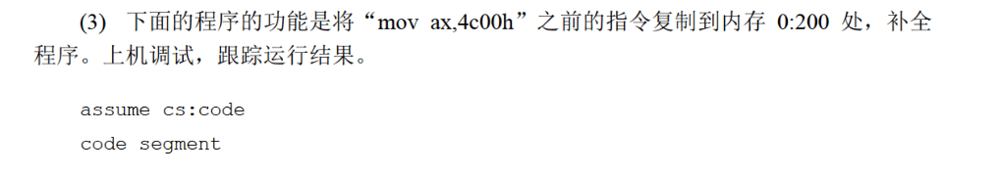
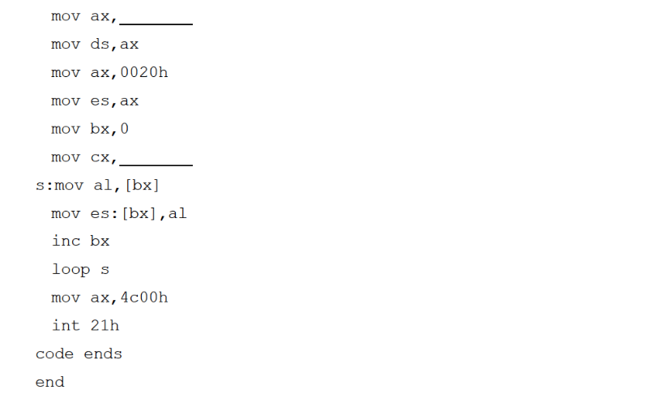
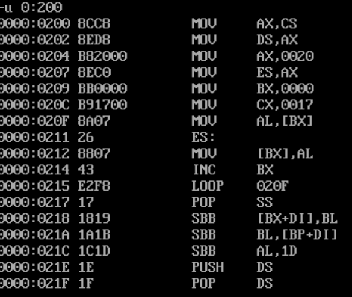

# 4


```
assume cs:code

code segment

    mov ax,0
    mov ds,ax
    mov bx,0
    mov cx,0040h
  s:mov [bx],bl
    inc bl
    loop s
    mov ax,4c00h
    int 21h

code ends

end
```

在dosbox里试一下：



没毛病。


done.





```
assume cs:code

code segment

   mov ax,cs
   mov ds,ax
   mov ax,0020h
   mov es,ax
   mov bx,0
   mov cx,17h
   s:mov al,[bx]
   mov es:[bx],al
   inc bx
   loop s
   mov ax,4c00h
   int 21h

code ends

end
```

要将程序对应的字节复制到`0000:0200`处，首先需要把`ds`设置为程序起始位置，即`cs`；

接着需要知道一共需要复制多少字节。手算一下，是23个，即17h。



确实是复制了

