# 5

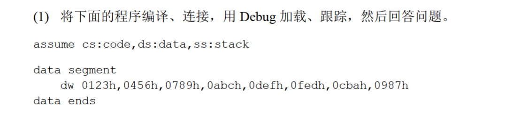

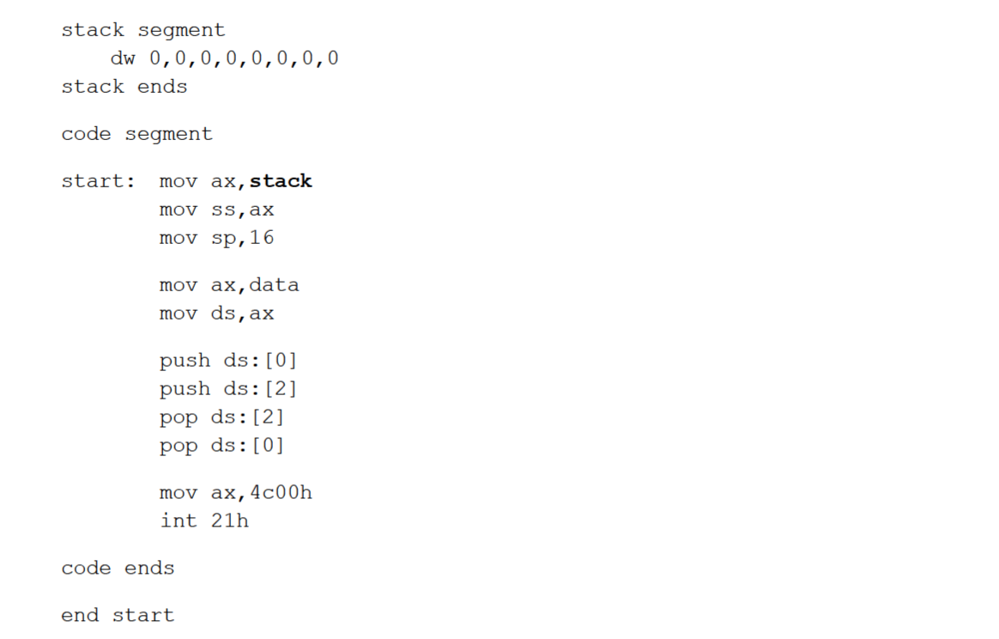

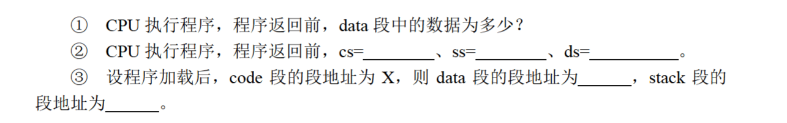

(1)程序返回前，各个寄存器的状态如下：

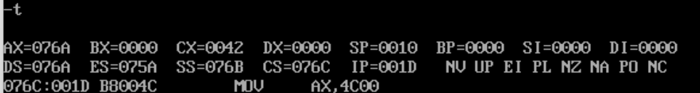

`data`段中的数据为：

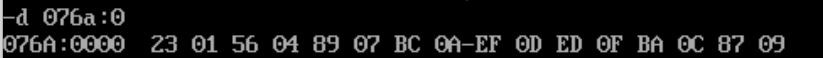

(2)由图可得`cs=076c,ss=076b,ds=076a`；

(3)`code`段之前的16个字节被用作栈段，因此`stack`段的地址为`X-1`；`stack`段之前的16个字节被用作数据段，因此`data`段的地址为`X-2`。

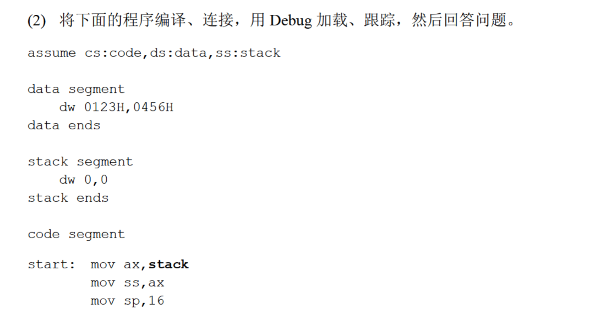

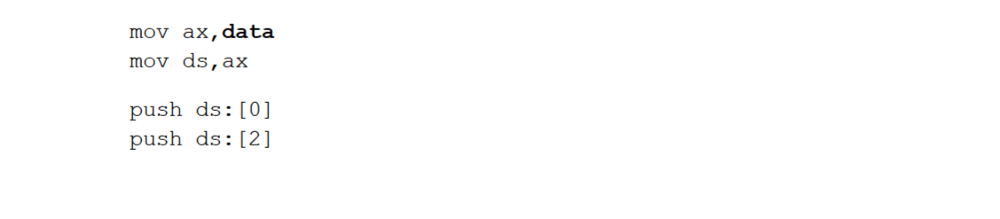

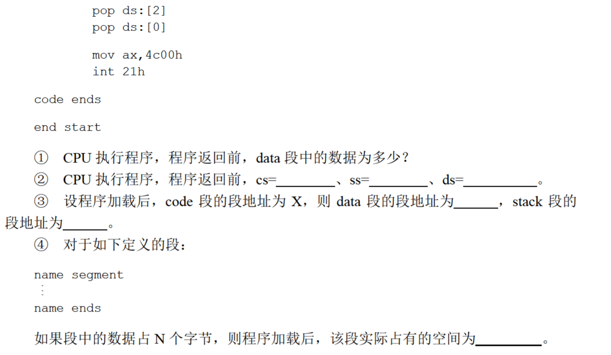

(1)这次`data`段中的数据只有4个字节，用-d看一下`ds:0`：

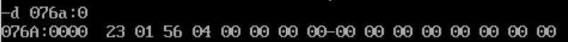

发现`ds:4~ds:f`都被清空了；

(2)程序返回前用-r看一下：

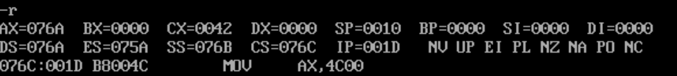

`cs=076c,ss=076b,ds=076a`；

(3)`data`段的地址为`X-2`，`stack`段的地址为`X-1`；

(4)如果N不是16的倍数，系统似乎会分配$\lceil\frac{N}{16}\rceil\times16$的空间给该段，因此该段实际占有空间为$\lceil\frac{N}{16}\rceil\times16$。

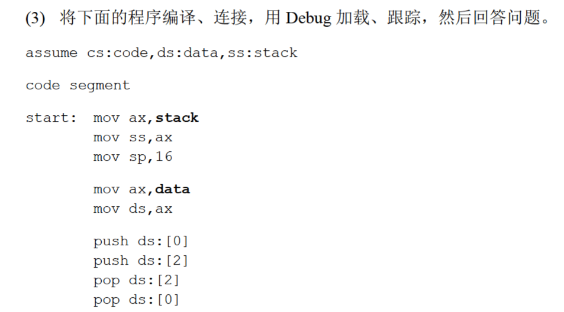

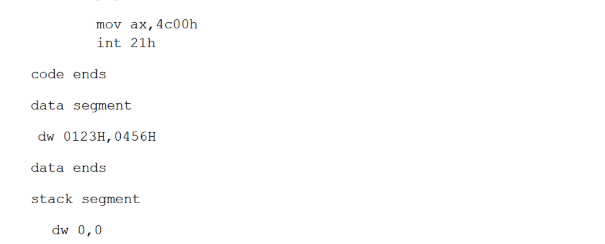

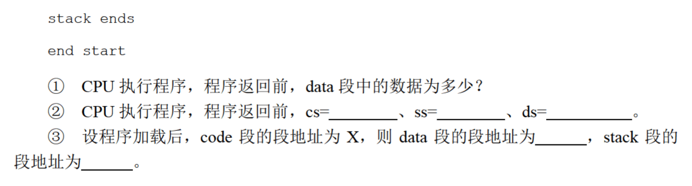

(1)程序返回前先看一眼各个寄存器的状态：

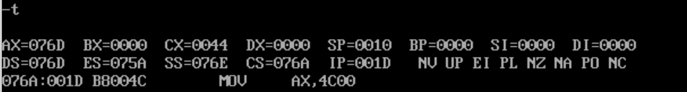

看一下`ds:0`：

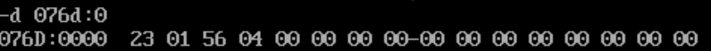

(2)由上图得`cs=076a,ss=076e,ds=076d`；

(3)用-d看了一下代码段的长度：

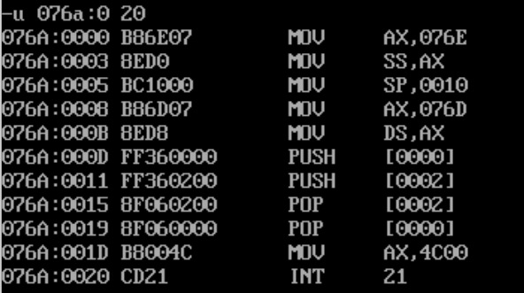

共34个字节，那么系统就会给代码段分配48节的空间，因此`data`段的段地址为`X+3`，`stack`段的段地址为`X+4`。

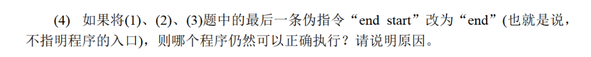

第一个程序不能正常执行：

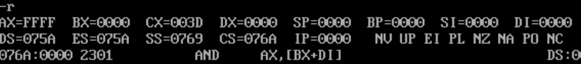

第一条指令就对不上，用-d观察一下内容：

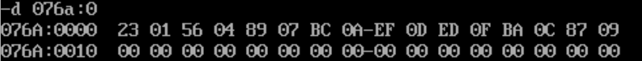

`076a:0~076a:f`的内容是数据段的内容，`076a:10~076a:1f`的内容是栈段的内容，那么代码段应该从`076a:20`开始：

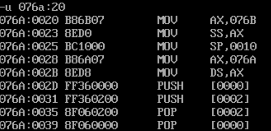

因为没有指明指令的入口，那么`cs:ip`就默认指向第一条指令，即数据段处;

第二条指令也不能正常执行：

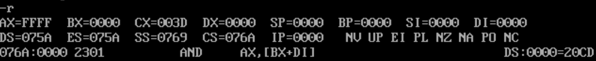

第一条指令对不上，真正的第一条指令应该在`076a:20`中：

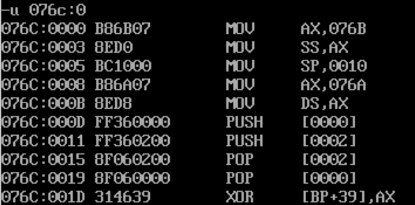

第三个程序可以正常执行：

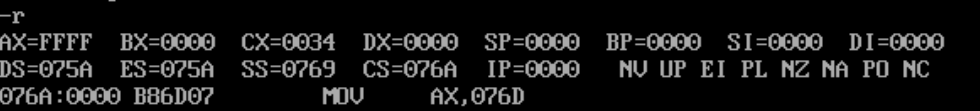

第一条指令位置正确，后续的指令也正确：

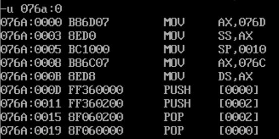

因为代码段在第一个位置，所以可以正常执行；

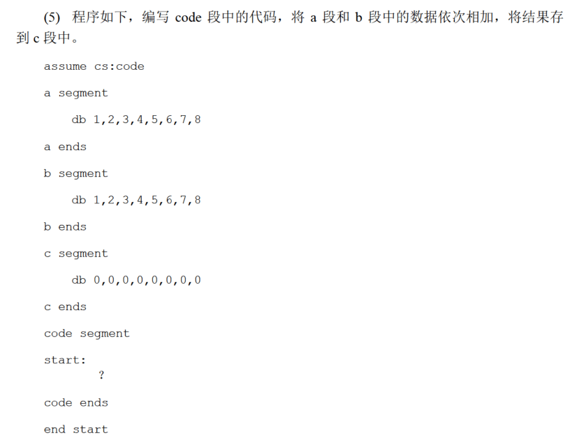

主要问题是确认各个数据段的位置。a段的起始位置是`cs-3`,b段的起始位置是`cs-2`，c段的起始位置是`cs-1`：

```
assume cs:code

a segment
    db 1,2,3,4,5,6,7,8
a ends

b segment 
    db 1,2,3,4,5,6,7,8
b ends


cdata segment
    db 0,0,0,0,0,0,0,0
cdata ends

code segment

start:
    mov ax,cs
    sub ax,2
    mov ds,ax
    sub ax,1
    mov es,ax
    mov bx,0
    mov cx,8
    mov dx,10h
s:  mov al,ds:[bx]
    add al,es:[bx]
    add bx,10h
    mov ds:[bx],al
    sub bx,10h
    inc bx
    inc dx
    loop s
    mov ax,4c00h
    int 21h

code ends

end start
```

运行结果：

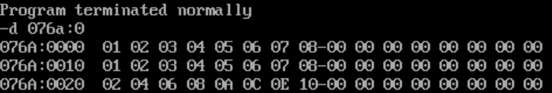

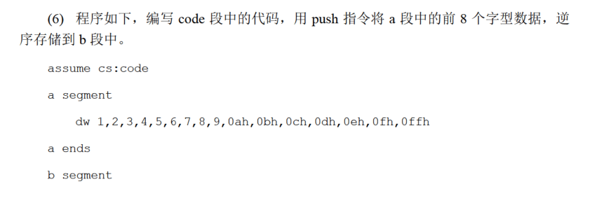

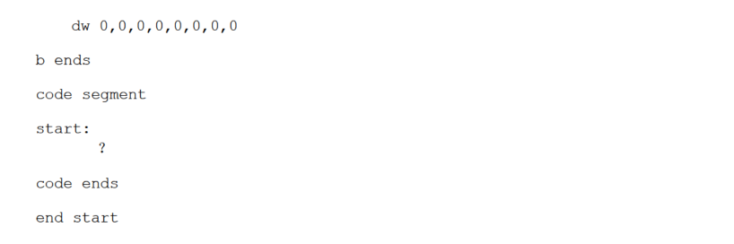

主要问题还是设置各个段的初始位置。

把栈段设置为`cs-1`，栈顶指针设置为`10h`，这样`push`的时候就能逆序将数据存储到栈中；数据段的位置应为`cs-3`：

```
assume cs:code

a segment
    dw 1,2,3,4,5,6,7,8,9,0ah,0bh,0ch,0dh,0eh,0fh,0ffh
a ends

b segment
    dw 0,0,0,0,0,0,0,0
b ends

code segment

start:
    mov ax,cs
    sub ax,1
    mov ss,ax
    mov sp,10h
    sub ax,2
    mov ds,ax
    mov bx,0
    mov cx,8
s:  push [bx]
    add bx,2
    loop s
    mov ax,4c00h
    int 21h


code ends

end start
```

运行结果：

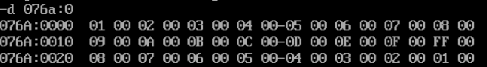
