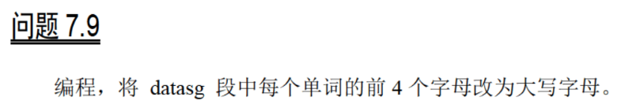
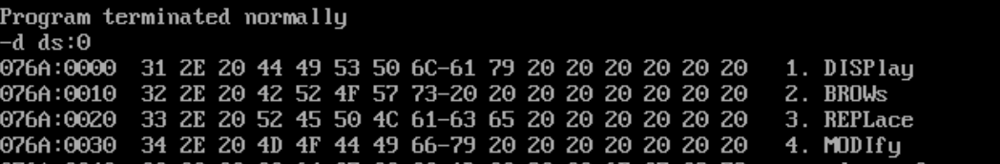

# 6




```
assume cs:codesg,ds:datasg,ss:stacksg

datasg segment

db '1. display      ' 
db '2. brows        '   
db '3. replace      '
db '4. modify       '

datasg ends

stacksg segment

    dw 0,0,0,0,0,0,0,0

stacksg ends

codesg segment

start:  mov ax,datasg
        mov ds,ax
        mov ax,stacksg
        mov ss,ax
        mov sp,16
        mov bx,0
        mov cx,4
    s:  push cx
        mov si,0
        mov cx,4
    s0: mov al,[bx+si+3]
        and al,11011111b
        mov [bx+si+3],al
        inc si
        loop s0
        add bx,16
        pop cx
        loop s
        mov ax,4c00h
        int 21h

codesg ends

end start
```

运行结果：



