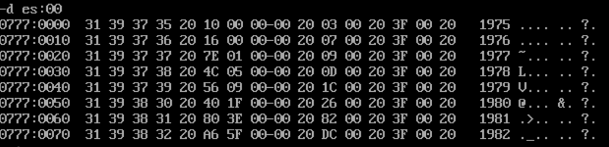

# 7


采用了4个循环，s0用来填充年份，s1用来填充空格和问号，s2用来填充收入，s3用来填充雇员：

```
assume cs:codesg,ds:datasg

datasg segment

    db '1975','1976','1977','1978','1979','1980','1981','1982','1983'
    db '1984','1985','1986','1987','1988','1989','1990','1991','1992'
    db '1993','1994','1995'

    dd 16,22,382,1356,2390,8000,16000,24486,50065,97479,140417,197514
    dd 345980,590827,803530,1183000,1843000,2759000,3753000,4649000,5937000

    dw 3,7,9,13,28,38,130,220,476,778,1001,1442,2258,2793,5635,8226
    dw 11542,14430,15257,17800

datasg ends

table segment

    db 21 dup ('year summ ne ?? ')

table ends

codesg segment

    start:  mov ax,datasg
            mov ds,ax
            mov ax,table
            mov es,ax
            mov bx,0

            mov cx,21
            mov si,0
            mov di,0
        s0: mov si,0
            mov ax,ds:[di]
            mov es:[bx][si],ax
            add si,2
            add di,2
            mov ax,ds:[di]
            mov es:[bx][si],ax
            add di,2
            add bx,16
            loop s0
            
            mov cx,21
            mov bx,0
        s1: mov byte ptr es:[bx][4],' '
            mov byte ptr es:[bx][9],' '
            mov byte ptr es:[bx][15],' '
            mov word ptr es:[bx][13],'?'
            add bx,16
            loop s1

            mov cx,21
            mov bx,0
            mov si,0
        s2: mov ax,ds:[si+84]
            mov es:[bx][5],ax
            mov ax,ds:[si+86]
            mov es:[bx][7],ax
            add bx,16
            add si,4
            loop s2

            mov cx,21
            mov bx,0
            mov si,0
        s3: mov ax,ds:[si+168]
            mov es:[bx][10],ax
            add bx,16
            add si,2
            loop s3
            
            mov ax,4c00h
            int 21h

codesg ends

end start
```

运行结果：




