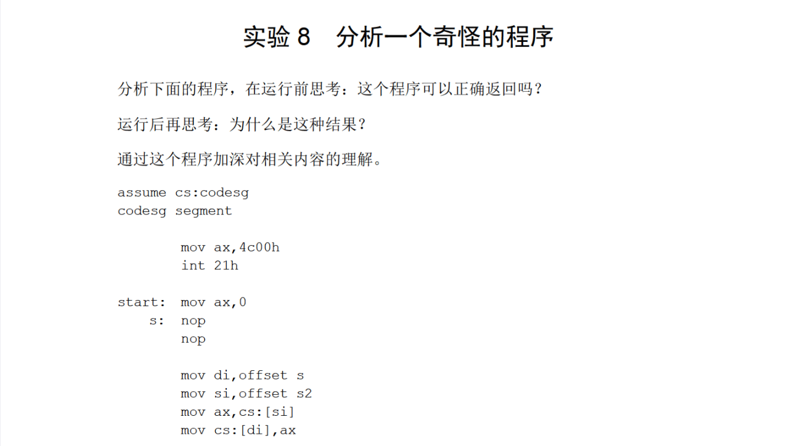
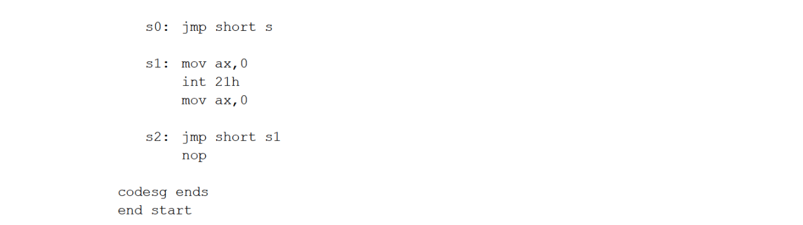
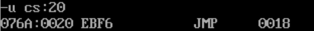
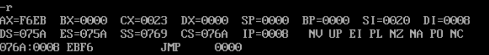
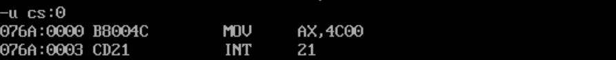

# 8

 



试了一下，确实可以返回。

下面是分析：

```
mov di,offset s
mov si,offset s2
mov ax,cs:[si]
mov cs:[di],ax
```

这一部分实际上是把`s`处的指令和`s2`处的指令交换了一下，因为用`jmp`进行段内短转移的指令长度只有一个字节，所以可以利用`ax`寄存器转移；

用-u查看了s2处的指令：



F6是-10的补码，那么`EBF6`表示向前跳10个字节；

那么现在`s`处的指令就不是`nop`了，而是`EBF6`，再看看执行完`s`处的指令后`cs:ip`会指向哪：



而`cs:0000`处是：




正确返回。