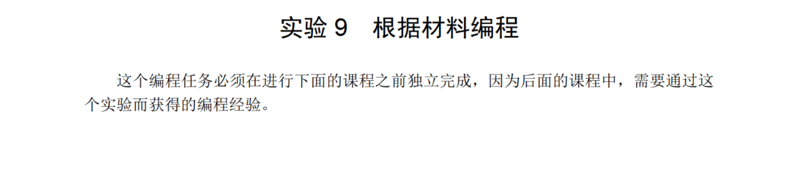
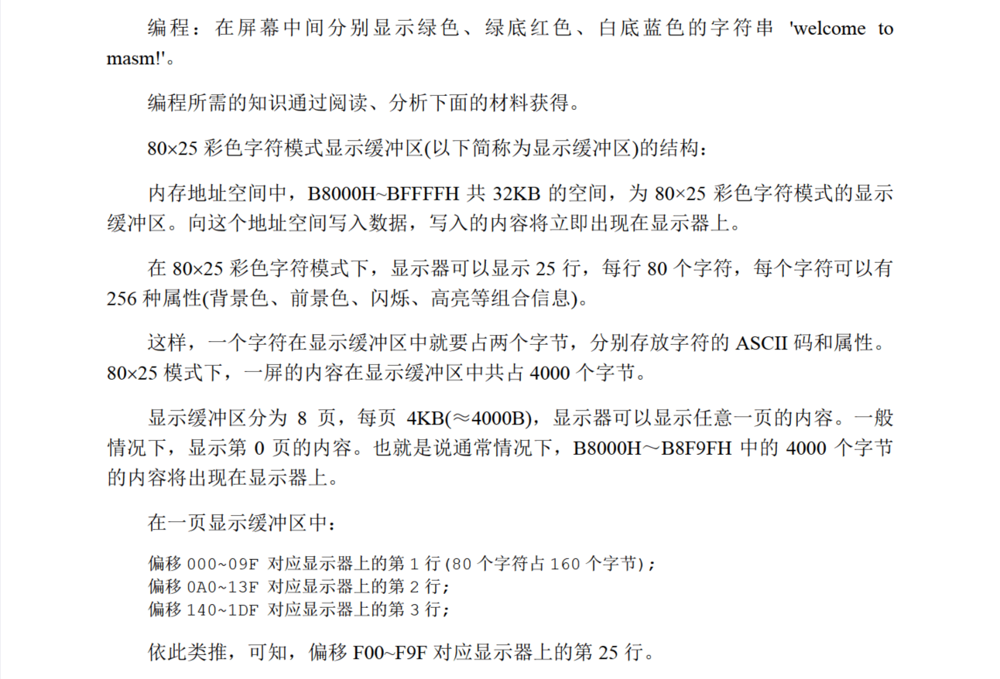
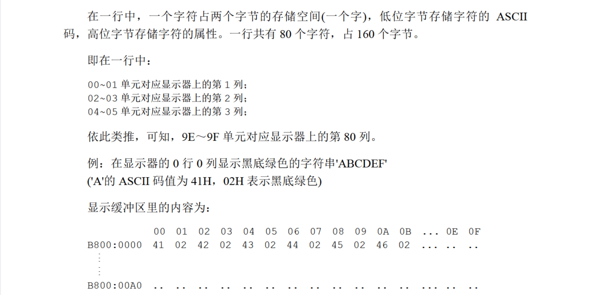
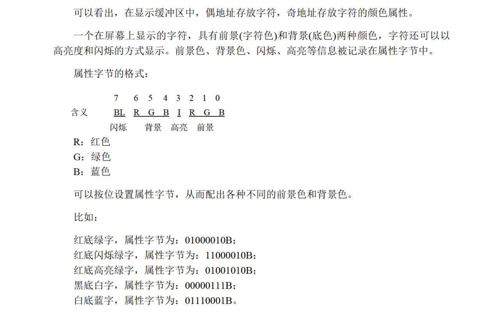
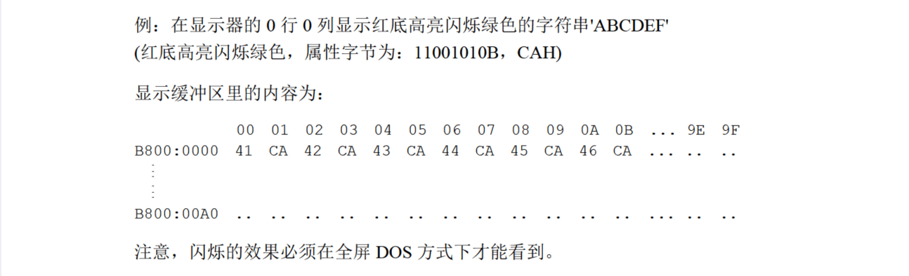
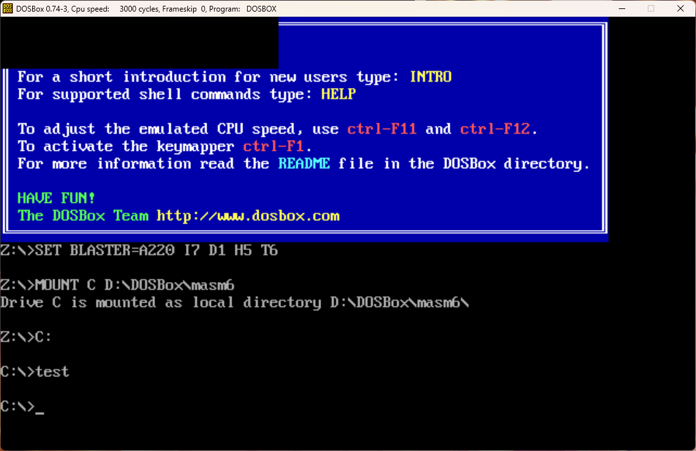

# 9











不知道为什么，运行程序后左上角变黑了，但是没有显示任何字符(



失败了......

姑且贴个代码吧：

```
assume cs:codesg,ds:datasg

datasg segment
    db 'welcome to masm!'
datasg ends

codesg segment
    start:  mov ax,datasg
            mov ds,ax
            mov ax,0B800h
            mov es,ax
            mov cx,16
            mov bx,0
            mov si,0
        s0: mov al,[bx]
            mov ah,0
            mov es:[si],ax
            add si,2
            mov ax,00000010b
            mov es:[si],ax
            add si,2
            inc bx
            loop s0

            mov cx,16
            mov bx,0
            mov si,0
        s1: mov al,[bx]
            mov ah,0
            mov es:[si+160],ax
            add si,2
            mov ax,00100100b
            mov es:[si+160],ax
            add si,2
            inc bx
            loop s1

            mov cx,16
            mov bx,0
            mov si,0
        s2: mov al,[bx]
            mov ah,0
            mov es:[si+320],ax
            add si,2
            mov ax,00000001b
            mov es:[si+320],ax
            add si,2
            inc bx
            loop s2

            mov ax,4c00h
            int 21h
codesg ends

end start
```

